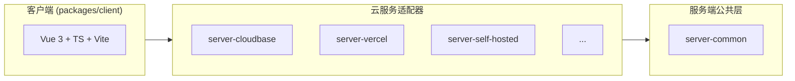

# Twikoo 2.0 开发者指引

本文面向本地二次开发，文档站内容见 `docs/`。

## 项目速览

Twikoo 是一个开源的静态网站评论系统。

## 环境要求

- Node.js 26
- pnpm

## 快速开始

```sh
pnpm install # 安装工作区依赖
pnpm demo # 一键启动本地演示（客户端、私有部署服务端、演示页）
```

### 目录 ↔ 包名对照表

目录名 ≠ 包名，所有代码中引用包名必须使用 `package.json` 里的 `name`，不可凭目录名推断。

```
twikoo/
├── docs/                      # twikoo-docs             ← VitePress 文档站
├── packages/
│   ├── shared/                # @twikoojs/shared        ← 前后端共享类型与常量
│   ├── tsdown-config/         # @twikoojs/tsdown-config ← 共享构建积木
│   ├── client/                # twikoo                  ← 前端库
│   ├── server-common/         # @twikoojs/common        ← 公共后端库，核心交付
│   ├── server-aws-lambda/     # @twikoojs/aws-lambda    ← AWS Lambda 适配器
│   ├── server-cloudbase/      # twikoo-func             ← 腾讯云 CloudBase 适配器
│   ├── server-edgeone-makers/ # twikoo-edgeone-makers   ← EdgeOne Makers 适配器
│   ├── server-netlify/        # twikoo-netlify          ← Netlify 适配器
│   ├── server-vercel/         # twikoo-vercel           ← Vercel 适配器
│   ├── server-self-hosted/    # tkserver                ← 私有部署适配器
│   ├── pkg/                   # twikoo-pkg              ← SEA 可执行产物打包流水线，产出私有部署可执行程序
│   ├── demo/                  # @twikoojs/demo          ← 本地演示工程
│   └── pushoo/                # pushoo                  ← 推送通道库
└── templates/                 # 一键部署模板（纯 JS，平台直取）
    ├── aws-lambda/src/        #   AWS Lambda（terraform/main.tf 的 source_path 指向它）
    ├── cloudbase/twikoo/      #   腾讯云开发（仓库根 cloudbaserc.json 指向它）
    ├── vercel-min/            #   Vercel（api/index.js + vercel.json + package.json）
    └── hf-space/              #   Hugging Face Space（Dockerfile + src/start.sh）
```

## 常用命令

```bash
pnpm build # 全仓构建
pnpm test # 全仓单元测试
pnpm lint # ESLint
pnpm lint:md # markdown 排版（AutoCorrect，只扫 *.md）
pnpm typecheck # 逐包 tsc --noEmit
pnpm e2e:b2 # 端到端回归
pnpm check:products # 客户端产物逐一 init + 形态断言 + tkserver 启动/shutdown
```

- `pnpm build` 是 `pnpm test`、`pnpm lint`、`pnpm typecheck`、`pnpm e2e:b2`、`pnpm check:products` 的前置
- 单包命令：`pnpm --filter <包名> <script>`（如 `pnpm --filter tkserver test`、`pnpm --filter twikoo build`、`pnpm --filter twikoo-docs docs:build`）。
- **Windows 开发者**：如遇脚本 shell 兼容问题，可用 `bash -lc "pnpm build"` 通过 Git Bash 执行。

## 架构说明



### 事件机制

客户端通过 HTTP POST 发送事件名，服务端 dispatcher 分发到对应 handler：

- 评论操作
  - `COMMENT_SUBMIT`
  - `COMMENT_GET`
  - `COMMENT_LIKE`
  - `COMMENT_DELETE_FOR_USER`
- 管理员操作
  - `COMMENT_GET_FOR_ADMIN`
  - `COMMENT_SET_FOR_ADMIN`
  - `COMMENT_DELETE_FOR_ADMIN`
  - `COMMENT_IMPORT_FOR_ADMIN`
  - `COMMENT_EXPORT_FOR_ADMIN`
- 统计
  - `COUNTER_GET`
  - `GET_COMMENTS_COUNT`
  - `GET_RECENT_COMMENTS`
- 配置/登录
  - `GET_CONFIG`
  - `GET_CONFIG_FOR_ADMIN`
  - `SET_CONFIG`
  - `LOGIN`
  - `GET_PASSWORD_STATUS`
  - `SET_PASSWORD`
- 验证码
  - `CAP_CHALLENGE`
  - `CAP_REDEEM`
- 邮件/上传/反垃圾
  - `EMAIL_TEST`
  - `UPLOAD_IMAGE`
  - `GET_QQ_NICK`
- 版本
  - `GET_FUNC_VERSION`
- 服务端内部事件
  - `POST_SUBMIT`

- 新增事件须在客户端 `api.ts`、`@twikoojs/common` dispatcher 中同步添加；适配器经 common 统一分发，只需声明 capabilities。
- 为了降低发送评论的耗时，`COMMENT_SUBMIT` 中不执行垃圾检测、邮件通知、即时消息通知，而通过调用 `POST_SUBMIT` 事件，由后者执行，即发送评论不等待耗时操作。

## 平台适配器开发指南

- **Ports 注入**：`request` / `response` / `database` / `storage` / `mailer` / `notifier` / `postSubmit` / `capabilities`
- **保持薄**：适配器只做「入口 + 适配器注入 + 平台载荷转换」，业务逻辑一律进 `@twikoojs/common`。
- **依赖完整性**：重依赖在适配器 `dependencies` 中声明（能力为 `true` ⇒ 关联包必须在 `dependencies` 里；
  无能力门的包人人必备）。由 `packages/server-common/test/adapter-deps.test.ts` 自动断言，无需人工核对。
  例外：用 `setCustomLibs` 注入自实现替代依赖的适配器，在 `OVERRIDE_SATISFIED` 里登记（该表有守卫用例）

## 代码规范

### 硬性规则

- **每个函数、类方法、导出常量上方必须写中文注释**
- TypeScript `strict`；语法目标 **ES2022**
- **`packages/*/src` 下不得出现 `.js`/`.mjs`/`.cjs` 源码**
- **`templates/**` 是唯一允许纯 JS 的地方**：云平台点「一键部署」时只克隆目录/仓库后 `npm install`
- 提交信息：Conventional Commits（`feat|fix|chore|docs|test|build|ci|refactor` + scope）

### 工具链

- **ESLint 9** flat（`vue3-recommended` + `typescript-eslint` type-checked）
- **Prettier**（`semi` · 双引号 · `trailingComma: "all"` · `printWidth: 100` · `tabWidth: 2`）
- **markdown 由 [AutoCorrect](https://github.com/huacnlee/autocorrect) 负责**：`pnpm lint:md` 检查、`pnpm format:md` 修复
- **Vitest 5**（工作区模式：根 `vitest.config.ts` 的 `projects` 发现各包 `vitest.config.ts`）

## CSS 规范

- **禁止** `<style scoped>`
- 类名统一 **`tk-` 前缀**（如 `.tk-submit`、`.tk-error`、`.tk-owo-emotion`）
- 作用域挂 **`.twikoo`** 根选择器（`.twikoo .tk-submit { ... }`）
- 为确保在浅色、深色博客主题上保持同样清晰，文字颜色需使用 `currentColor`，边框、背景颜色需使用半透明颜色

## 依赖规则

### 动态 import

- **对重依赖用动态 `import()`**（`@twikoojs/common` 经 `utils/lib-loader.ts` 的 `LITERAL_LOADERS` 表加载）
- **specifier 必须写字面量**：`import(specifier)` 一旦是变量，静态追踪器（Vercel 的 `@vercel/nft`、
  SEA 单文件打包、rolldown 依赖内联）就解析不到包，依赖不会进产物 → 运行时 `LibLoadError`。
  表项是**函数体内的 thunk**（不在模块顶层执行），故惰性不受影响；「不进产物」由各包
  `deps.neverBundle` 保证。纪律由 `test/utils/lib-loader-literals.test.ts` 兜底

### 重依赖清单（全部 external + 动态加载）

- `nodemailer`
- `jsdom`
- `dompurify`
- `@imaegoo/node-ip2region`
- `akismet-api`
- `tencentcloud-sdk-nodejs-tms`
- `form-data`
- `bowser`
- `marked`
- `xml2js`
- `html-to-text`
- `pushoo`
- `@xsai/*`
- `lokijs`
- `mongodb`

### 声明方式

- **适配器**：按需在 `dependencies` 中声明实际使用的重依赖（按 capabilities 人工核对，`marked` 亦在通用清单内）
- **`@twikoojs/common`**：重依赖统一以 `peerDependencies` + `peerDependenciesMeta.optional` 声明——既表达接口约束，又让 pnpm 把它们链接到 common 侧

### 禁止事项

- ❌ 重依赖顶层静态 `import`（`packages/server-common/src/**`）
- ❌ 在 `@twikoojs/common` 中硬依赖特定平台库
- ❌ 手工修改任何发布包 `package.json` 的 `version`（见「版本与发布」）

## 国际化（i18n）

- **一语言一文件**：`packages/client/src/i18n/locales/*.json`
- **真相源**：`locales/_keys.json`（键集合），`TranslationKey` 类型保证缺键时 tsc 报错
- **兜底**：`en`——缺键或分片加载失败时降级英文，绝不阻塞渲染
- **语言别名**：`zh` → `zh-CN`、`en-GB` → `en` 等
- 新增 UI 文本须同步补齐全部 9 种语言

### 打包与按需加载

简体中文和英文 `zh-CN` / `en` **内置**进主产物（`en` 同时是 fallback 源），其余语言各自一个独立分片 `dist/locales/<lang>.js`（ESM），运行时按需 `import()`

语言文件从**主脚本自身 URL** 推导（UMD 无 `import.meta.url`）：`document.currentScript.src` → 回退扫描 `script[src]` 中含 `twikoo` 者；可用 `init({ localeBaseUrl })` 或 `setLocaleBaseUrl()` 显式覆写。加载失败**回退英文**。

## 版本与发布

### 包名规则

2.0 前已经存在的包名，继续使用，2.0 后新增的包名，必须使用 `@twikoojs/*` 命名空间。

### 版本号规则

- **所有发布包的 `version` 恒为 `0.0.0`**
- 版本号由 CI 在发布时从 **Release tag** 注入，不进入 git
- `pushoo` 不再维护独立版本线：与 `twikoo` 同版本发布，其变更随 twikoo 版本一起出去

### 发布产物

- 每个发布包用 `files` 白名单（`["dist"]`）决定入包内容，`src/`、`test/`、构建配置都不进包。
  **不建 `.npmignore`**：npm 在 `files` 存在时会忽略根 `.npmignore`（黑名单只在没有 `files` 时生效），
  加了也只有零行为变化。
- **私有包必须 `private: true`**。只靠「约定不发布」不够 —— 从包目录里 `npm publish` 仍能发出去。

### 发布流程（`publish.yml`）

1. **在 GitHub 网页创建 Release**（tag 即版本号；勾选 pre-release → npm `beta` dist-tag、Docker `beta` 通道 tag）
2. `release: published` 触发 `publish.yml`：版本格式 → 所有包基线 → **单调性**（新版本必须大于已发布的最高同线版本）→ 未发布过
3. `publish`（无需按依赖关系分批），随后 `verify` 确认所有包都在 npm 可见
4. `publish-docker`（通道 tag 与 npm dist-tag 同源：预发布推 `imaegoo/twikoo:beta`、正式版推 `:latest`，两种情况都另推精确版本号 tag；**`arm32v7` 只在正式版发布**）
5. `publish-pkg`（SEA 产物用 `gh release upload` 挂到**已有** Release）
6. 发布脚本：`scripts/release-set-version.mjs`（基线校验 / 覆写）、`release-version-check.mjs`（单调性 / 未发布过）、`verify-npm.mjs`（可见性 gate）

> npm 侧走 **OIDC 信任发布**（不使用 npm token），但每个包须先在 npmjs.com 上配好 Trusted Publisher
> Docker 推送需要 `DOCKER_USERNAME` / `DOCKER_PASSWORD`，**预发布与正式版都会用到**

### 文档站发布（`docs.yml`）

push 到 `main` 且改动 `docs/**`、或 Release published、或手动触发 → VitePress 构建 → `imaegoo/vuepress-deploy` 推 `gh-pages`。

### Docker / pkg

- `Dockerfile`：装 npm 上已发布的 `tkserver@<版本>`（publish.yml 的 docker job 用 `TWIKOO_VERSION` build-arg 传入），运行 `/app/node_modules/.bin/tkserver`，`TWIKOO_DATA=/app/data`
- `packages/pkg`：tsdown + SEA，`exe.targets[].nodeVersion` = **26.9.0**（目标运行时 = 仓库基线；**必须是完整 `x.y.z`**，写主版本会被 `@tsdown/exe` 拒绝）；**构建宿主需 Node ≥ 25.7**

## 测试

### 框架与组织

- **Vitest 5**；各包 `vitest.config.ts` 由根配置 `projects` 自动发现（含 `docs/vitest.config.ts`）
- 测试与实现同包：`packages/*/test/**`、`docs/test/**`
- 契约测试：`@twikoojs/common` 的共享契约套件覆盖全部事件，各适配器复用

### 覆盖率门禁

- `twikoo` ≥ 70%
- `@twikoojs/common` ≥ 80%

> **客户端覆盖率口径**：`packages/client/vitest.config.ts` 的 `coverage.include` 仅含 `src/**/*.ts`，**刻意排除 `.vue` 组件**，SFC 组件行为已由 `test/components.test.ts` / `test/tk-components.test.ts` 等功能用例覆盖。

### `.env` 机制

- 新增任何环境变量，必须同步更新 `.env.example`（含用途注释）
- 测试通过 `hasEnv()` 判定「空字符串 = 未配置」→ 对应用例**整体 skip**；本地真实值写入根 `.env`（已 gitignore）

## 错误处理

### 服务端

- 统一响应体：`{ code: number, ... }`，`code` 数值（0 成功 / 1000 通用失败）

### 客户端（`TwikooError`）

- `NETWORK`: 网络连接失败（断网、DNS 解析错误）
- `CORS`: 跨域请求被浏览器拦截
- `TIMEOUT`: 请求超时
- `REJECTED`: 服务端拒绝请求（非 2xx 响应）
- `NOT_FOUND`: 请求目标不存在（404）
- `CLIENT_ERROR`: 客户端参数错误（4xx，除 CORS/404）
- `SERVER_ERROR`: 服务端内部错误（5xx）
- `UNKNOWN`: 无法归类的其他错误

每个错误对象附带 `httpStatus` / `rawMessage` / `hintKey` / `solutionsKey` / `logText`，评论区渲染**内联错误卡片** + 可折叠详情；日志分级由 `TWIKOO_LOG_LEVEL` 控制。排障对照表见文档站「常见问题 → 常见错误排查」。
