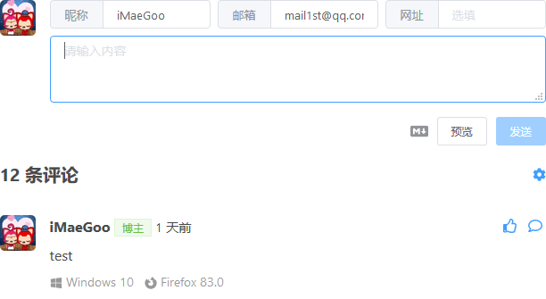
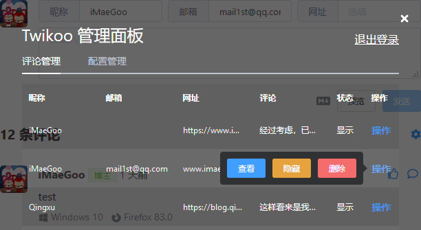
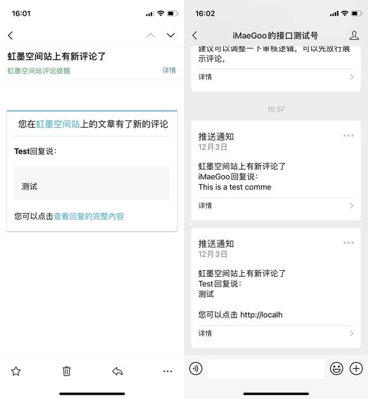

<a href="https://twikoo.js.org/"></a>

----

[](https://www.npmjs.com/package/twikoo)
[](https://bundlephobia.com/result?p=twikoo)
[](https://www.npmjs.com/package/twikoo)
[](https://www.jsdelivr.com/package/npm/twikoo)
[](./LICENSE)


A **simple**, **safe**, **free** comment system based on Tencent CloudBase (tcb).  
[简体中文](./README.md) | **English**  

**This document is for American English.**

## Features

<details>
<summary>Click to view.</summary>

### Simple

* Free Build.（Using Tencent CloudBase as the commenting backend, each user enjoys 1 free standard basic version 1 resource package for a long time）
* Simple Deployment.（Support one-click deployment, manual deployment, command deployment）

### Easy to use

* Support reply, like.
* No additional adaptations, support with light theme and dark theme use.
* Support API , batch get article comment count, latest comments.
* Visitors entering QQ number in the nickname field will automatically complete the QQ nickname and QQ email.
* Visitors fill in the digital QQ e-mail, will use the QQ avatar as the comment avatar.
* Support the comment to paste pictures.（Can be disabled）
* Support inserting pictures.（Can be disabled）
* Support 7bu image bed, Tencent CloudBase image bed.
* Support inserting emoji.（Can be disabled）
* Support Ctrl + Enter reply.
* Comments are saved in draft in real time and will not be lost when refreshed.
* [Support Katex formulas.](https://twikoo.js.org/faq.html#%E5%A6%82%E4%BD%95%E5%90%AF%E7%94%A8-katex-%E6%94%AF%E6%8C%81)
* Support for code highlighting by language.

### Security

* Privacy and information security. (sensitive fields (email, IP, environment configuration, etc.) are not leaked through Tencent cloud function control)
* Support for Akismet spam comment detection.（View Details [akismet.com](https://akismet.com/)）
* Support Tencent Cloud content security spam comment detection.（View Details [Tencent Cloud Content Security](https://console.cloud.tencent.com/cms/text/overview)）
* Support manual review mode.
* Anti XSS Attack.
* Support for limiting the maximum number of comments per IP per 10 minutes.

### notification

* E-mail（Visitors and Blogger）
* Wechat（only Blogger, [Server酱](https://sc.ftqq.com/3.version)）
* QQ（only Blogger, [Qmsg酱](https://qmsg.zendee.cn/)）

### Personalization

* Background image.
* the "blogger" logo text.
* Notification Email Template.
* Comment prompt message.（placeholder）
* emoji（[OwO 的数据格式](https://cdn.jsdelivr.net/npm/owo@1.0.2/demo/OwO.json)）
* 【Nickname】 【Email】 【Website】 Required / Optional
* Code highlighting theme.

### Management

* Embedded panel with password login to easily view comments, hide comments, delete comments and modify configuration.
* Support to hide the management portal and show it by entering a secret code.
* Support for importing comments from Valine, Artalk, Disqus.

### Disadvantages

* Slower requests. (except China)
* Deployment requires real name authentication.
* IE is not supported.

</details>

## Preview

<details>
<summary>Click to view.</summary>

### Comments



### Management



### Notification



</details>

## Quick Start

[](https://console.cloud.tencent.com/tcb/env/index?action=CreateAndDeployCloudBaseProject&appUrl=https%3A%2F%2Fgithub.com%2Fimaegoo%2Ftwikoo&branch=main)

[View Details](https://twikoo.js.org/quick-start.html)

<details>
<summary>If you want to get updates, make suggestions and participate in the test, welcome to join the discussion group：1080829142 (QQ)</summary>

</details>

<!-- ## Contributors -->

## Special Thanks

Icon design：[Maemo Lee](https://www.maemo.cc)

<!-- ## Donate -->

## Release notes & plans

[Update logs](https://github.com/imaegoo/twikoo/releases) & [Development Plan](https://github.com/imaegoo/twikoo/projects/2)

##  Development

If you want to develop locally for a second time, you can refer to the following commands：

``` sh
yarn dev # (http://localhost:9820/demo.html)
yarn lint 
yarn build # (dist/twikoo.all.min.js)
```

If your changes can help more people, feel free to submit a Pull Request!

## I18N

Support Simplified Chinese, Traditional Chinese, English. [translate Pull Request](https://github.com/imaegoo/twikoo/tree/main/src/js/utils/i18n).

## License

<details>
<summary>MIT License</summary>

[](https://app.fossa.com/projects/git%2Bgithub.com%2Fimaegoo%2Ftwikoo?ref=badge_large)

</details>
