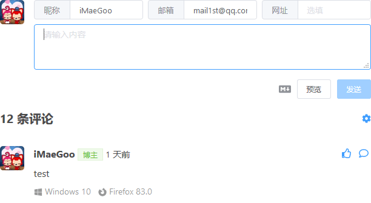
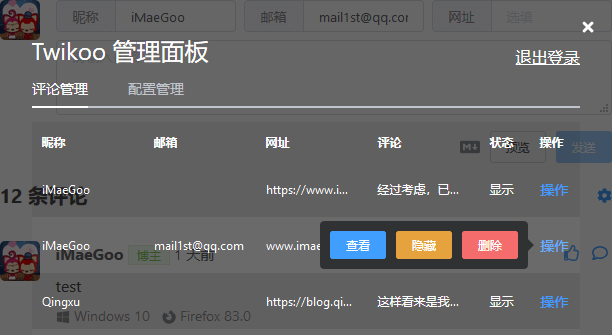
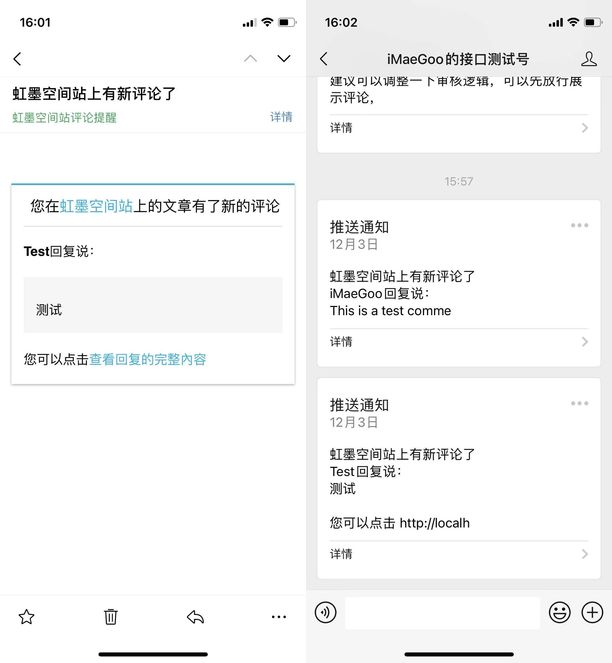

<a href="https://twikoo.js.org/"></a>

---

[](https://www.npmjs.com/package/twikoo)
[](https://bundlephobia.com/result?p=twikoo)
[](https://www.npmjs.com/package/twikoo)
[](https://www.jsdelivr.com/package/npm/twikoo)
[](https://cloudback.it)
[](./LICENSE)

A **simple**, **safe**, **free** comment system.  
**English** | [简体中文](./README.md)

## Features

### Simple

- Free Build.(Support CloudBase, Vercel, Netlify, Hugging Face, Railway, Zeabur, Cloudflare Workers, AWS Lambda, EdgeOne Makers, or self-hosted as the commenting backend)
- Simple Deployment.(Vercel one-click deployment, illustrated guides for every platform, plus Docker self-hosting)

### Easy to use

- Support reply, like, dislike.
- No additional adaptations, support with light theme and dark theme use.
- Support API , batch get article comment count, latest comments.
- Visitors entering QQ number in the nickname field will automatically complete the QQ nickname and QQ email.
- Visitors fill in the digital QQ e-mail, will use the QQ avatar as the comment avatar.
- Support the comment to paste pictures.(Can be disabled)
- Support inserting pictures.(Can be disabled)
- Support CloudBase, 7bu, S.EE, Lsky Pro, PicList, EasyImage, Chevereto image beds, and S3-compatible storage (R2 / MinIO, etc.)
- Support inserting emoji.(Can be disabled)
- Support Ctrl + Enter reply.
- Comments are saved in draft in real time and will not be lost when refreshed.
- [Support Katex formulas.](https://twikoo.js.org/faq.html#%E5%A6%82%E4%BD%95%E5%90%AF%E7%94%A8-katex-%E6%94%AF%E6%8C%81)
- Support for code highlighting by language.

### Security

- Privacy and information security. (sensitive fields (email, IP, environment configuration, etc.) are not leaked through Tencent cloud function control)
- Support for Akismet spam comment detection.(View Details [akismet.com](https://akismet.com/)）
- Support Tencent Cloud content security spam comment detection.(View Details [Tencent Cloud Content Security](https://console.cloud.tencent.com/cms/text/overview)）
- Support manual review mode.
- Anti XSS Attack.
- Support for limiting the maximum number of comments per IP per 10 minutes.

### notification

- E-mail (visitors and blogger)
- WeChat (blogger only, via [Server 酱](https://sct.ftqq.com/r/13235), registration required)
- QQ (blogger only, via [Qmsg 酱](https://qmsg.zendee.cn/), service registration required)
- QQ (blogger only, via [go-cqhttp](https://docs.go-cqhttp.org/), self-hosting/configuring the bot and a QQ account required)
- DingTalk, WeCom, Feishu, Telegram, Discord, Bark, PushDeer, WxPusher and more (blogger only, via [pushoo](https://twikoo.js.org/pushoo.html), registration required)

### Personalization

- Background image.
- the "blogger" logo text.
- Notification Email Template.
- Comment prompt message.（placeholder）
- emoji（[OwO 的数据格式](https://cdn.jsdelivr.net/npm/owo@1.0.2/demo/OwO.json)）
- 【Nickname】 【Email】 【Website】 Required / Optional
- Code highlighting theme.

### Management

- Embedded panel with password login to easily view comments, hide comments, delete comments and modify configuration.
- Support to hide the management portal and show it by entering a secret code.
- Support for importing comments from Valine, Artalk, Disqus.

## Preview

<details>
<summary>Click to view.</summary>

### Comments



### Management



### Notification



</details>

## Quick Start

[](https://console.cloud.tencent.com/tcb/env/index?action=CreateAndDeployCloudBaseProject&appUrl=https%3A%2F%2Fgithub.com%2Fimaegoo%2Ftwikoo&branch=main)

[View Details](https://twikoo.js.org/quick-start.html)

<details>
<summary>If you want to get updates, make suggestions and participate in the test, welcome to join the discussion group: 1080829142 (QQ)</summary>

</details>

<!-- ## Contributors -->

## Special Thanks

Icon design:[Maemo Lee](https://www.maemo.cc)

<!-- ## Donate -->

## Release notes & plans

[Update logs](https://github.com/twikoojs/twikoo/releases) & [Development Plan](https://github.com/twikoojs/twikoo/projects/2)

## Development

This repository is a pnpm monorepo (Node 26). To hack on it locally:

```sh
pnpm install # install dependencies
pnpm demo    # one-command local demo: client watch + tkserver + demo page (http://localhost:9820/demo.html)
pnpm lint    # lint
pnpm typecheck
pnpm test    # unit tests
pnpm build   # build (packages/client/dist/twikoo.all.min.js)
```

If your changes can help more people, feel free to submit a Pull Request!

## I18N

Supports 9 locales (zh-CN, zh-HK, zh-TW, en, ja-JP, ko-KR, vi-VN, id-ID, uz-UZ). [Translate Pull Request](https://github.com/twikoojs/twikoo/tree/main/packages/client/src/i18n/locales).

## License

<details>
<summary>MIT License</summary>

[](https://app.fossa.com/projects/git%2Bgithub.com%2Fimaegoo%2Ftwikoo?ref=badge_large)

</details>
