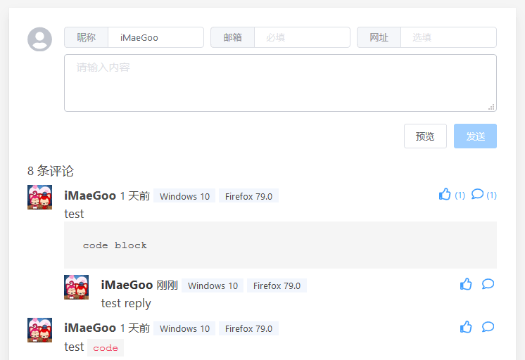

# Twikoo

一个（仍处于开发初期的）简洁、安全、无后端的静态网站评论系统，基于腾讯云开发。<br>
A simple, safe, serverless comment system based on Tencent CloudBase (tcb).


[](https://app.fossa.com/projects/git%2Bgithub.com%2Fimaegoo%2Ftwikoo?ref=badge_shield)

## 特色 | Features

* 评论 | Comment
* 点赞 | Like
* 纯静态 | Static pages
* 可嵌入 | Embedded
* 免费搭建 | Free deploy
* 存储安全 | Security
* 反垃圾评论 | Akismet
* 邮件 / 微信通知 | Email / WeChat notify

## 快速开始 | Quick Start

**文档尚未完善，请关注后续更新；<br>
如果你想获取更新动态、建言献策、参与内测，欢迎加入内测群：**


1. 注册 https://console.cloud.tencent.com/tcb/
2. 部署云函数
```
npm install
npx tcb login
npx tcb functions:deploy
```
3. HTML 片段
``` html
...
<div id="twikoo"></div>
<script src="./twikoo.all.min.js"></script>
<script>
  twikoo.init({
    envId: 'imaegoo-16fe3d'
  });
</script>
...
```

<!-- ## 贡献者 | Contributors -->

<!-- ## 捐赠 | Donate -->

## 开发 | Development

```
npm run serve
npm run build
```

## 国际化 | I18N

鉴于腾讯云在中国以外地区的支持程度，本项目暂无国际化计划。

## 许可 | License

[MIT License](./LICENSE)


[](https://app.fossa.com/projects/git%2Bgithub.com%2Fimaegoo%2Ftwikoo?ref=badge_large)