# 云函数部署

| <div style="width: 6em">部署方式</div> | 推荐度 | 描述 |
| ---- | ---- | ---- |
| [腾讯云 CloudBase 部署](#腾讯云-cloudbase-部署) | ★★★☆☆ | 手动部署到腾讯云云开发环境，在中国大陆访问速度较快。需要付费购买环境才能部署。 |
| [宝塔面板 部署](#宝塔面板-部署) | ★★★☆☆ | 适用于有服务器的用户，通过宝塔面板 (9.2.0+) 的 Docker 应用商店安装。 |
| [Vercel 部署](#vercel-部署) | ★★★☆☆ | 适用于想要免费部署的用户，在中国大陆访问速度较慢甚至无法访问，绑定自己的域名可以提高访问速度。 |
| [Railway 部署](#railway-部署) | ★★☆☆☆ | 有免费额度但不足以支持一个月连续运行，部署简单，适合全球访问。 |
| [Zeabur 部署](#zeabur-部署) | ★☆☆☆☆ | 需要绑定支付宝或信用卡，部署简单，适合中国大陆访问，免费计划环境随时可能会被删除。 |
| [Netlify 部署](#netlify-部署) | ★★★★☆ | 有充足的免费额度，中国大陆访问速度不错。 |
| [Hugging Face 部署](#hugging-face-部署) | ★★★☆☆ | 免费，中国大陆访问速度不错。允许通过 Cloudflare Tunnels 自定义域名。 |
| [AWS Lambda 部署](#aws-lambda-部署) | ★★★☆☆ | 全球最大的云平台，适合已经使用 AWS 全家桶的用户。 |
| [Cloudflare workers 部署](#cloudflare-workers-部署) | ★★☆☆☆ | 部署需使用命令行，冷启动时间较短，功能有部分限制。2.0 起使用 Cloudflare D1 数据库，适配器在 [packages/server-cloudflare](https://github.com/twikoojs/twikoo/tree/main/packages/server-cloudflare)。 |
| [EdgeOne Makers 部署](#edgeone-makers-部署) | ★★☆☆☆ | 腾讯云 EdgeOne Makers 的函数部署，网页控制台上传 ZIP 即可，无需命令行。**必须绑定自定义域名**（默认域名链接仅 3 小时有效）。功能受限：邮件仅支持部分通道，无垃圾评论检测与 AI 功能。 |
| [私有部署](#私有部署) | ★★☆☆☆ | 适用于有服务器的用户，需要自行申请 HTTPS 证书。 |
| [私有部署 (Docker)](#私有部署-docker) | ★★★☆☆ | 适用于有服务器的用户，需要自行申请 HTTPS 证书。 |

## 腾讯云 CloudBase 部署

如果您打算部署到一个现有的云开发环境，请直接从第 2 步开始。

1. 进入[云开发 CloudBase 购买页面](https://buy.cloud.tencent.com/lowcode?buyType=tcb)，数据库请选择“云数据库”，其余选项按页面提示填写，点击“立即购买”，按提示创建好环境。
::: tip 提示
- 推荐创建上海环境。如选择其它环境，需要在 `twikoo.init()` 时额外指定环境 `region: "ap-guangzhou"`
- 环境名称自由填写
:::

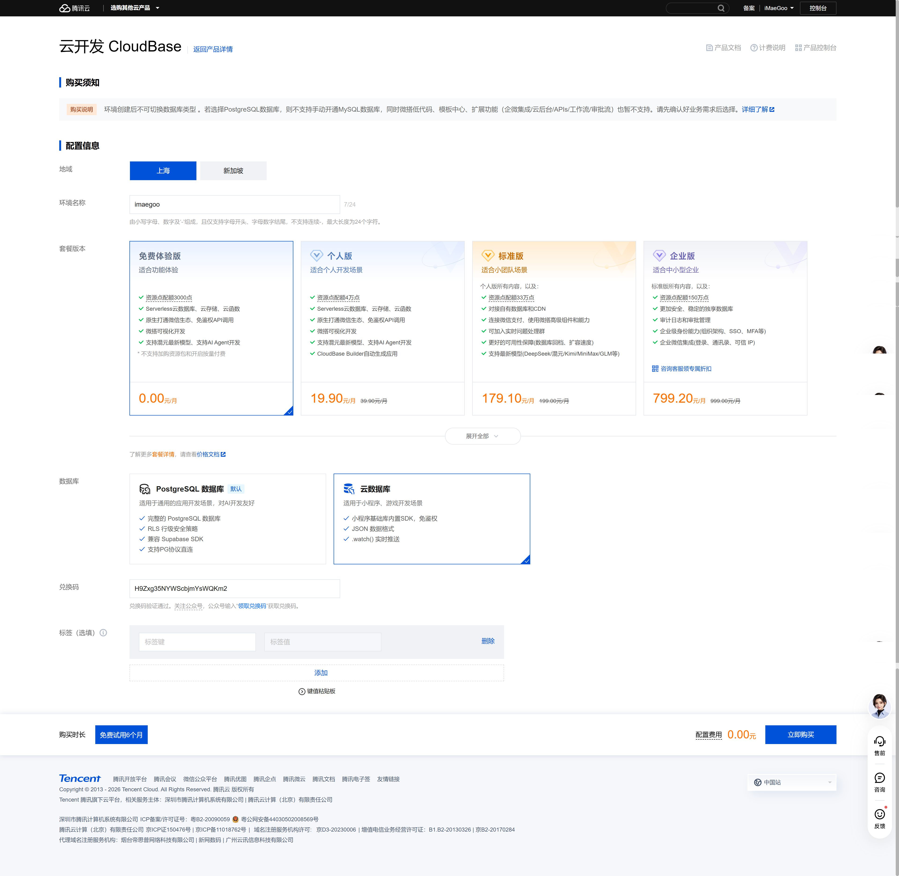

2. 进入[云开发新版开发平台](https://tcb.cloud.tencent.com/dev)<br>
3. 进入“身份认证 - 配置 - 登录方式”，启用“允许匿名登入”

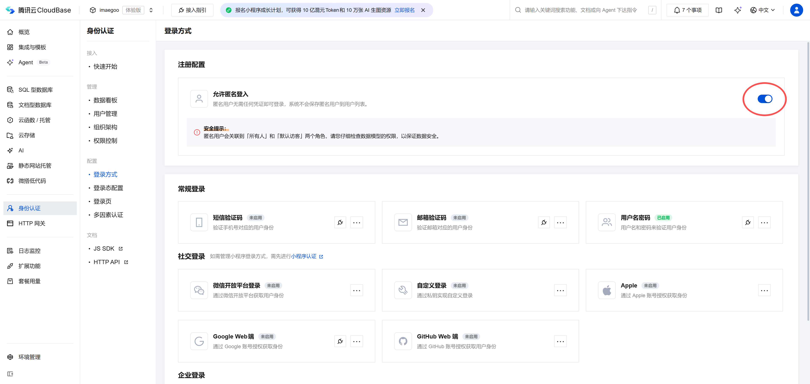

4. 进入“HTTP 网关 - 跨域设置 - 添加跨域域名”，添加网站域名（免费套餐无法添加，需升级付费套餐才能添加）

5. 进入“云函数/托管 - 云函数 - 函数管理”，点击“权限控制”，将输入框内容修改为以下内容，然后点击确定

```json
{
  "*": {
    "invoke": "auth != null"
  }
}
```

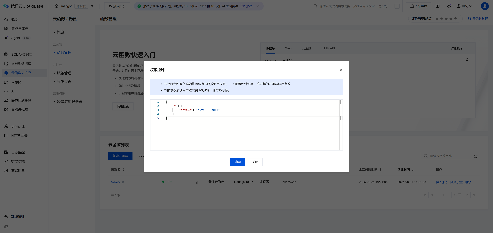

6. 进入“云函数/托管 - 云函数 - 函数管理”，点击“新建云函数”，点击“通过模板创建-Node.js Hello World”
7. 打开 `index.js` 文件，清空输入框中的示例代码，复制以下代码、粘贴到代码框中

```js
exports.main = require("twikoo-func").main;
```

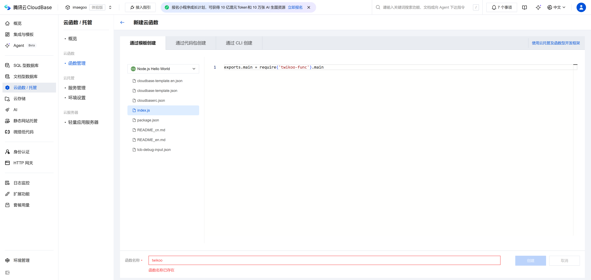

8. 打开 `package.json` 文件，清空输入框中的示例代码，复制以下代码、粘贴到代码框中

```json
{ "dependencies": { "twikoo-func": "latest" } }
```

::: tip 为什么写 latest
`latest` 始终指向最新稳定版，升级时在控制台点一次「保存并安装依赖」即可，不用记版本号。
如果你希望锁死版本，也可以改写成具体版本号，只是每次升级都要手动改。
:::

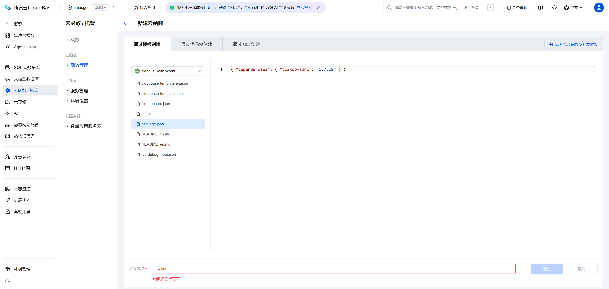

9. 其它文件不用修改，页面下方的函数名称请填写：`twikoo`，点击“创建”
10. 等待函数状态变为“正常”后，环境部署完成，鼠标悬浮到页面左上角的环境名称上，即可看到您的 envId，注意腾讯云环境的 envId 为 `环境名称-数字字母` 组合，不带 `https://` 的前缀

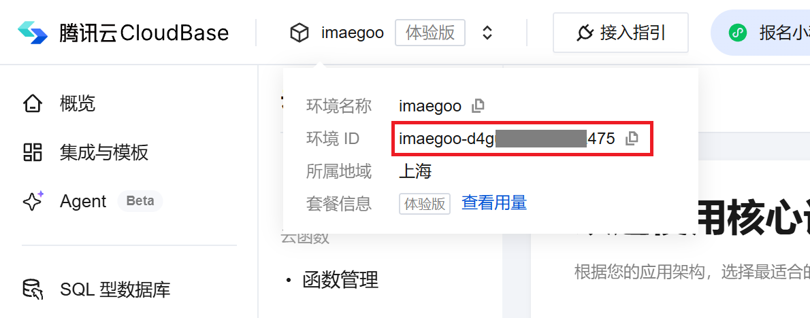

## 宝塔面板 部署

::: warning 注意
宝塔面板 (适用 9.2.0 及以上的版本)
:::

前往 [宝塔面板官网](https://www.bt.cn/new/download.html)，选择正式版的脚本下载安装（如果已安装，请跳过此步）

1. 安装后登录宝塔面板，在左侧导航栏点击 Docker，首先进入会提示安装 Docker 服务，点击立即安装，按提示完成安装


2. 完成安装后在应用商店中找到 Twikoo，点击安装，配置域名、端口等基本信息即可完成安装


注意：域名为非必填，如果填写了域名则通过【网站】-【反向代理】来管理，填写域名后不需要勾选【允许外部访问】，否则需要勾选后才可以通过端口访问

3. 安装后在浏览器输入上一步设置的域名或者 IP + 端口即可访问。

## Vercel 部署

::: warning 注意
Vercel 部署的环境需配合 1.4.0 以上版本的 twikoo.js 使用

默认域名 `*.vercel.app` 在中国大陆访问速度较慢甚至无法访问，绑定自己的域名可以提高访问速度
:::

[查看视频教程](https://www.bilibili.com/video/BV1Fh411e7ZH)

1. 申请 [MongoDB Atlas](./mongodb-atlas.md) 账号，获取 MongoDB 连接字符串
2. 申请 [Vercel](https://vercel.com/signup) 账号
3. 点击以下按钮将 Twikoo 一键部署到 Vercel<br>

[](https://vercel.com/import/project?template=https://github.com/twikoojs/twikoo/tree/main/templates/vercel-min)

::: tip 这个按钮部署的是什么
`templates/vercel-min` 是一个**纯 JS 转发壳**（`api/index.js` 只做一件事：`require("twikoo-vercel")`
再转发出去，Web 入口由 `vercel.json` 全量重写到 `api/index`），依赖跟随 `twikoo-vercel` 的 **`latest`** 标签。
Vercel 侧只装这一个 npm 依赖、不跑任何构建，所以**升级只需在 Deployments 里重新部署一次**。
:::

4. 进入 Settings - Environment Variables，添加环境变量 `MONGODB_URI`，值为前面记录的数据库连接字符串
5. 进入 Settings - Deployment Protection，设置 Vercel Authentication 为 Disabled，并 Save

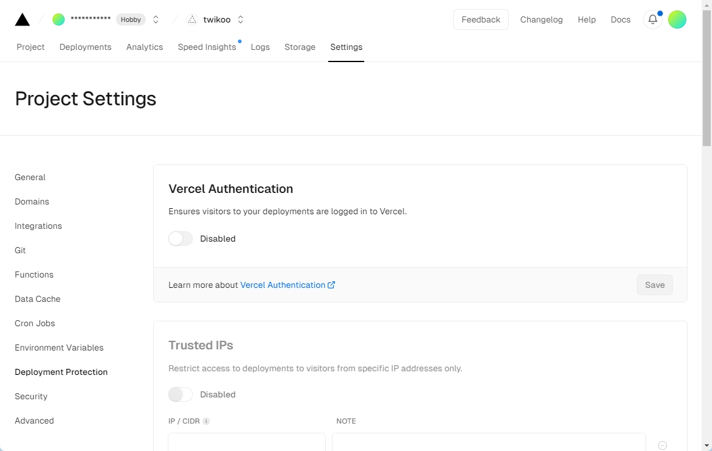

6. 进入 Deployments , 然后在任意一项后面点击更多（三个点） , 然后点击 Redeploy , 最后点击下面的 Redeploy
7. 进入 Overview，点击 Domains 下方的链接，如果环境配置正确，可以看到“Twikoo 云函数运行正常”的提示
8. Vercel Domains（包含 `https://` 前缀，例如 `https://xxx.vercel.app`）即为您的环境 id

## Railway 部署

::: warning 注意
Railway 部署的环境需配合 1.4.0 以上版本的 twikoo.js 使用

请一定要创建 MongoDB，不创建 MongoDB 也能正常使用，但重新部署后数据会丢失！
:::

1. 在 [Railway](https://railway.app/dashboard) 申请并登录账号，点击 New Project - Provision MongoDB，名称随意
2. 打开 [twikoojs/twikoo-zeabur](https://github.com/twikoojs/twikoo-zeabur) 点击 fork 将仓库 fork 到自己的账号下
3. 回到 Railway 点击 New - GitHub Repo - Configure GitHub App - 授权 GitHub - 选择刚才 fork 的仓库，等待部署完成
4. 点开环境卡片 - Variables - New Variable，左边输入 `PORT` 右边输入 `8080` 然后点 Add
5. 同样地，添加 MongoDB 相关环境变量 - New Variable - Add Reference - MONGO* - Add，重复步骤以添加 `MONGOHOST`、`MONGOPASSWORD`、`MONGOPORT`、`MONGOUSER` 和 `MONGO_URL` 环境变量。
6. 点开环境卡片 - Settings - Environment - Domains，绑定一个域名（例如 `mytwikoo.up.railway.app`）
7. 到博客配置文件中配置 envId 为 `https://` 加域名（例如 `https://mytwikoo.up.railway.app`）

## Zeabur 部署

::: warning 注意
Zeabur 部署的环境需配合 1.4.0 以上版本的 twikoo.js 使用

请一定要创建 MongoDB，不创建 MongoDB 也能正常使用，但重新部署后数据会丢失！
:::

1. 在 [Zeabur](https://dash.zeabur.com) 申请并登录账号，点击部署新服务 - 部署其他服务 - 部署 MongoDB，名称随意
2. 打开 [twikoojs/twikoo-zeabur](https://github.com/twikoojs/twikoo-zeabur) 点击 fork 将仓库 fork 到自己的账号下
3. 回到 Zeabur 点击部署新服务 - 部署你的源代码 - 授权 GitHub - 选择刚才 fork 的仓库，名称随意

> _无需配置数据库连接字符串！Zeabur 已自动配置_

4. 部署好后点开环境卡片 - 设置 - 域名，绑定一个域名（例如 `mytwikoo.zeabur.app`）
5. 到博客配置文件中配置 envId 为 `https://` 加域名（例如 `https://mytwikoo.zeabur.app`）

## Netlify 部署

::: warning 注意
Netlify 部署的环境需配合 1.4.0 以上版本的 twikoo.js 使用

Netlify 免费等级（Functions Level 0）支持每月 125,000 请求次数和 100 小时函数计算时长
:::

1. 申请 [MongoDB Atlas](./mongodb-atlas.md) 账号，获取 MongoDB 连接字符串
2. 申请并登录 [Netlify](https://app.netlify.com) 账号，创建一个 Team
3. 打开 [twikoojs/twikoo-netlify](https://github.com/twikoojs/twikoo-netlify) 点击 fork 将仓库 fork 到自己的账号下
4. 回到 Netlify，点击 Add new site - Import an existing project

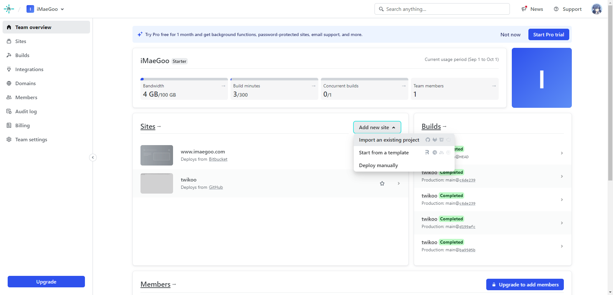

5. 点击 Deploy with GitHub，如果未授权 GitHub 账号，先授权，然后选择前面 fork 的 twikoo-netlify 项目

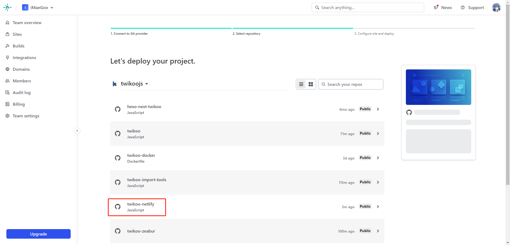

6. 点击 Add environment variables - New variable，Key 输入 `MONGODB_URI`，Value 输入前面记录的数据库连接字符串，点击 Deploy twikoo-netlify

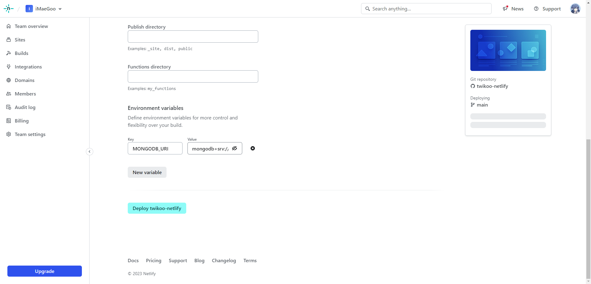

7. 部署完成后，点击 Domain settings - 右侧 Options - Edit site name，可以设置属于自己的三级域名（`https://xxx.netlify.app`）

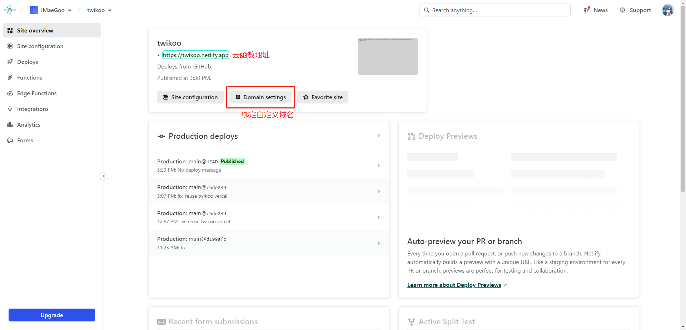

8. 进入 Site overview，点击上方的链接，如果环境配置正确，可以看到“Twikoo 云函数运行正常”的提示

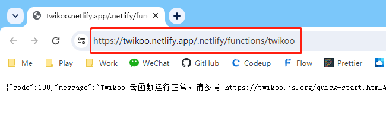

9. 云函数地址（包含 `https://` 前缀和 `/.netlify/functions/twikoo` 后缀，例如 `https://xxx.netlify.app/.netlify/functions/twikoo`）即为您的环境 id

## Hugging Face 部署

::: warning 注意
Hugging Face 部署的环境，由于默认的邮件端口被屏蔽，无法使用邮件功能。详见 [twikoo/issues/638](https://github.com/twikoojs/twikoo/issues/638)
:::

1. 申请 [MongoDB Atlas](./mongodb-atlas.md) 账号，获取 MongoDB 连接字符串
2. 申请 [Hugging Face](https://huggingface.co/join) 账号
3. 登录，点击 Spaces - Create new Space

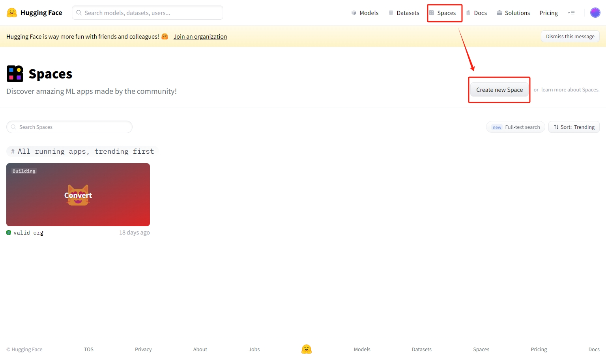

4. 输入 Space name，Select the Space SDK 选择 Docker，Choose a Docker template 选择 Blank，Space hardware 选择 FREE，选择 Public，点击 Create Space

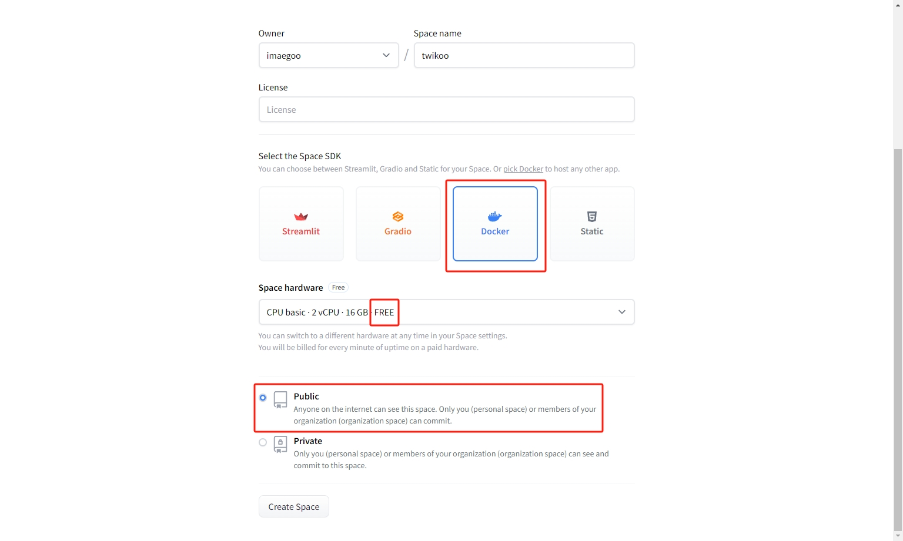

5. 进入刚刚创建的 Space，点击页面上方的 Settings，滚动到 Variables and secrets 部分，点击 New secret，Name 输入 `MONGODB_URI`，Value 输入前面记录的数据库连接字符串，点击 Save

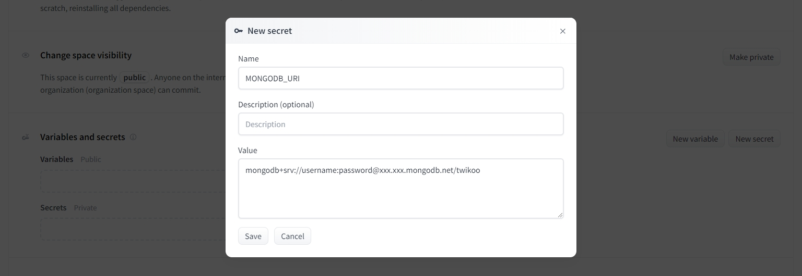

6. 点击页面上方的 Files - Add file - Create a new file

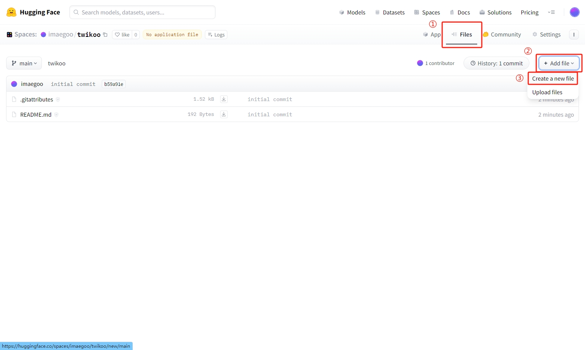

7. 在 Name your file 中输入 `Dockerfile`，在 Edit 区域输入以下内容

```Dockerfile
FROM imaegoo/twikoo
ENV TWIKOO_PORT 7860
EXPOSE 7860
```

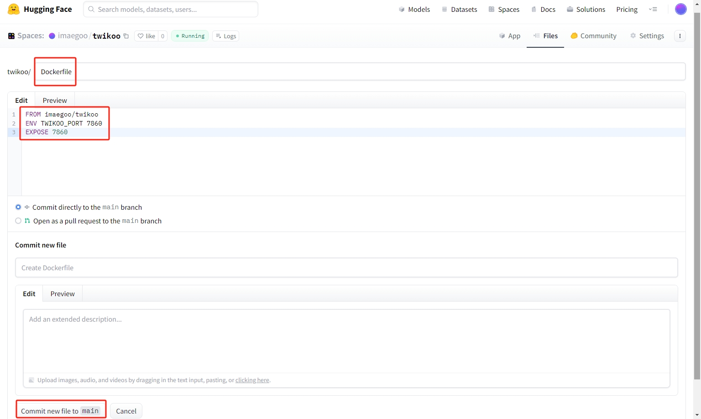

8. 点击 Commit new file to main
9. 点击右上角 Settings 右方的菜单（三个点）图标 - Embed this Space，Direct URL 下的内容（例如 `https://xxx-xxx.hf.space`）即为您的环境 id

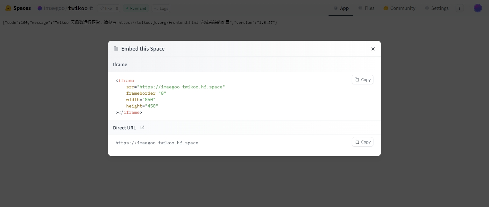

### 如果你需要自定义域名

> 自定义域名教程由 [Hoshino-Yumetsuki](https://github.com/Hoshino-Yumetsuki) 提供
>
> ps：除了 `CF_ZERO_TRUST_TOKEN` 这个环境变量以外，其他环境变量的配置方式与上一步相同

1. 申请 Cloudflare Zero Trust，关于申请方式请自行查找

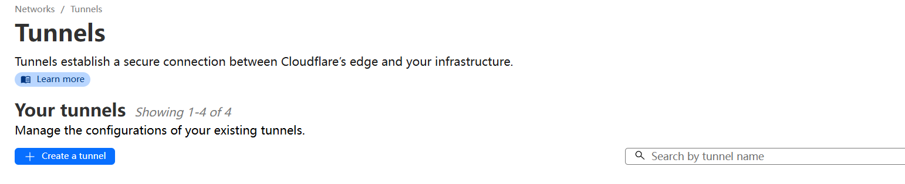

2. 添加一条隧道，连接方式选择 Cloudflared，名称任意

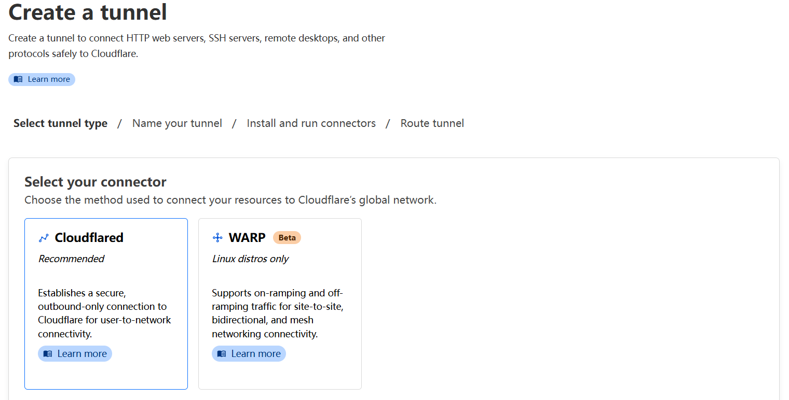

3. 添加一个 Public Hostname，回源选择 HTTP，端口选择 8080
4. Clone Twikoo 仓库，找到 `templates/hf-space`
5. 去 Hugging Face 创建一个 Space，然后 Clone 下来，将 hf-space 文件夹内的所有内容复制进去
6. 在 Hugging Face Space 的设置中添加一个环境变量，变量名 `CF_ZERO_TRUST_TOKEN`，值是 Tunnels 给的令牌（删掉 `cloudflared.exe service install`，只保留令牌部分）

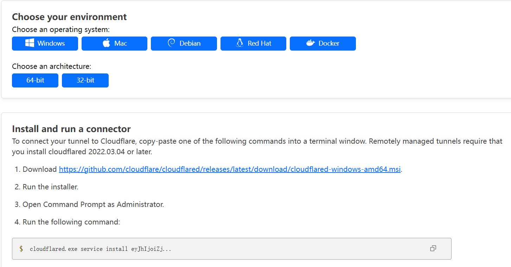

7. Push 到 Hugging Face Space 仓库

## AWS Lambda 部署

1. 注册 AWS 账号并配置 Terraform CLI。
2. 如需使用托管的 MongoDB 数据库，可申请 [MongoDB Atlas](./mongodb-atlas.md) 账号。
3. 克隆本仓库，进入 `templates/aws-lambda`；先把依赖装进源码目录（Terraform 会把整个目录打包，云端不装 Node.js 依赖）：

   ```sh
   cd templates/aws-lambda/src
   npm install
   ```

4. 在 `templates/aws-lambda/terraform` 下执行（`mongodb_uri` 换成您的连接字符串）：

   ```sh
   terraform init
   terraform apply -var="mongodb_uri=mongodb+srv://..."
   ```

   该模板创建一个 Lambda 函数（入口 `index.handler`，代码就是 `src/index.js` 里一行
   `require("@twikoojs/aws-lambda")`，实现跟随 npm 上的 `latest`）并开放函数 URL。

5. 部署完成后，Terraform 会将 `lambda_function_url` 打印在屏幕上，您也可以使用 `terraform output` 获取这一 URL，如：

```
$ terraform output
lambda_function_url = "https://axtoiiithbcexamplegq7ozalu0cnkii.lambda-url.us-west-2.on.aws/"
```

该 URL 即为您的环境 ID，请记下这一 URL 用于前端配置。

## Cloudflare workers 部署

::: warning 注意
Cloudflare 部署的功能限制：邮件通知仅支持 SendGrid / MailChannels / Resend 三个通道（Workers 无法直连 SMTP）；不支持 Akismet、腾讯云内容审核，也没有 AI 功能；图片上传请使用 S3 兼容图床（Cloudflare R2 支持 S3 协议）。
:::

部署使用 Cloudflare Workers 与 D1 数据库，全程命令行操作。

1. 克隆本仓库并构建（需 Node.js 26 与 pnpm）：

   ```sh
   pnpm install
   pnpm build
   ```

2. 进入适配器目录，登录 Cloudflare 并创建 D1 数据库：

   ```sh
   cd packages/server-cloudflare
   npx wrangler login
   npx wrangler d1 create twikoo
   ```

3. 按上一步输出的 `database_name` 与 `database_id` 写好包内 `wrangler.toml`（模板见[适配器 README](https://github.com/twikoojs/twikoo/tree/main/packages/server-cloudflare)），然后建表：

   ```sh
   npx wrangler d1 execute twikoo --remote --file=./schema.sql
   ```

4. 部署：

   ```sh
   npx wrangler deploy
   ```

5. 命令行会输出 `https://twikoo.<你的用户名>.workers.dev`，浏览器访问它应看到 `Twikoo 云函数运行正常，请参考…`，该地址（含 `https://`）即为前端的 `envId`。

从 1.x 的 [twikoojs/twikoo-cloudflare](https://github.com/twikoojs/twikoo-cloudflare) 升级：D1 表形态与 1.x 一致，数据可以直接沿用，云函数首次请求会自动补上 2.0 新增的列。更多细节（能力矩阵、邮件与图床配置、IP 属地实现）见[适配器 README](https://github.com/twikoojs/twikoo/tree/main/packages/server-cloudflare)。

## EdgeOne Makers 部署

::: warning 注意
EdgeOne Makers 部署有两项前置约束：

1. **必须绑定自定义域名**。平台默认域名（`*.edgeone.cool`）的链接**仅有 3 小时限时预览**，且不带校验参数直接访问会返回 401；Twikoo 需要一个长期稳定的 `envId`，因此自定义域名是硬性前提。
2. **功能受限**：邮件通知仅支持 SendGrid / MailChannels / 自建 SMTP 桥接通道；不支持 Akismet、腾讯云内容审核等垃圾评论检测，也没有 AI 功能。
   :::

部署全程在网页控制台完成，无需命令行、无需 Git。

1. 下载一键部署包：[twikoo-edgeone-makers.zip](https://github.com/twikoojs/twikoo/raw/main/templates/edgeone-makers/twikoo-edgeone-makers.zip)

   该 ZIP 只有三个文件（函数入口、SMTP 桥接的 Go 源码与依赖声明），**请勿解压**，直接用于下一步上传。云函数实现由平台从 npm 上的 `@twikoojs/edgeone-makers` 自动取回，因此升级 Twikoo 只需在项目里点**重新部署**，无需重新下载。

2. 进入 [EdgeOne Makers 控制台](https://console.cloud.tencent.com/edgeone/makers)，在「项目」标签页点击**直接上传**

3. 填写项目名称（5-50 字符，仅小写字母、数字与连字符，连字符不能位于开头、结尾或连续出现），选择加速区域，把上一步下载的 ZIP 拖入上传区域，点击**开始部署**

4. 等待状态变为**成功**

   ::: tip 数据库无需配置
   评论数据存放在平台自动提供的 **Blob KV** 中：首次写入时平台会自动创建命名空间，**无需任何额外配置**，也不需要自备数据库。
   :::

5. 进入**项目设置**，把**Node.js 版本**改为 `24.18.0` 并保存

   该项决定**构建时**使用的 Node.js 版本，平台默认值偏低，与 2.0 的产物与依赖要求不符。注意控制台提示「变更后将在下一次部署时生效」，因此保存后需回到**构建部署**页点一次**重新部署**。

6. 此时云函数已就绪，但还不能用于博客，请继续配置自定义域名。

### 绑定自定义域名

1. 进入项目的**域名管理**页，点击**添加自定义域名**
2. 输入你的域名，「需要关联的环境」选择**生产**，点击**下一步**
3. 等待状态从「部署中」变为「请添加 CNAME」，复制页面上显示的 CNAME 值
4. 到你的域名提供商处，为该域名添加一条 CNAME 记录，指向复制的值
5. 回到域名管理页，点击 **HTTPS 配置**下的**配置**
6. 点击**边缘 HTTPS 证书**下的**配置**，选择**申请免费证书**，点击**自动验证**，然后点击**保存**

   下方「强制 HTTPS」「HTTP Strict Transport Security (HSTS)」「OCSP 装订」三项可按需开启，推荐开启**强制 HTTPS**与**OCSP 装订**。

7. 等待页面状态变为**已生效**，自定义域名即配置完成

### 配置前端

域名生效后，浏览器访问 `https://你的域名/`，应看到 `Twikoo 云函数运行正常，请参考…`。该地址（含 `https://`，不带路径）即为前端的 `envId`。

::: tip 为什么 `envId` 是域名根
部署包把云函数放在 `cloud-functions/index.js`，平台会将其映射到 `PATH: /`。因此部署包根目录**刻意不含** `index.html`——静态资源与函数路由冲突时静态资源优先，一旦根目录存在 `index.html`，`/` 就会返回网页而不是云函数。
:::

### 邮件通知（可选）

EdgeOne Makers 的 Node.js 函数运行时不支持 TCP socket，无法直连 SMTP。可用通道：

- **SendGrid / MailChannels**：在 Twikoo 管理面板的邮件配置中把发信服务选为对应项并填入 API Key
- **自建 SMTP 桥接**：**无需另建服务** —— 部署包内的 `cloud-functions/smtp.go` 会被平台编译成
  同一个项目下的 `/smtp` 路由，由它负责真正的 SMTP 建连；Twikoo 云函数会向自己的域名请求
  `/smtp`。启用步骤：
  1. 在**项目设置 → 环境变量**中新增 `TWIKOO_SMTP_BRIDGE_TOKEN`，值用随机长字符串
     （可用 `node -e "console.log(require('crypto').randomBytes(32).toString('hex'))"` 生成；
     它用于保护 `/smtp` 路由，**不是** SMTP 密码）
  2. 在 Twikoo 管理面板配置 `SMTP_HOST`、`SMTP_PORT`、`SMTP_SECURE`、`SMTP_USER`、
     `SMTP_PASS`、`SENDER_EMAIL`（465 端口通常 `SMTP_SECURE=true`，587 端口通常为 `false`）
  3. **不要**同时配置 `SMTP_SERVICE`，否则会走 SendGrid / MailChannels 的 HTTP 通道

  ::: tip 桥接地址不需要你填
  Twikoo 云函数按「前端配置的 `envId` → `Origin` 头 → `Host` 头」的顺序推断桥接地址，
  三者都指向本项目自己的域名，再拼上 `/smtp`。因此**不需要**在配置里填桥接地址，
  自定义域名生效后也会自动跟随。
  :::

更多细节（能力矩阵、IP 属地实现、构建方式）见[适配器 README](https://github.com/twikoojs/twikoo/tree/main/packages/server-edgeone-makers)与[模板说明](https://github.com/twikoojs/twikoo/tree/main/templates/edgeone-makers)。

## 私有部署

::: warning 注意
私有部署的环境需配合 1.6.0 或以上版本的 twikoo.js 使用

私有部署对服务器系统没有要求，Windows、Ubuntu、CentOS、macOS 等常用系统均支持。

私有部署涉及终端操作、申请证书、配置反向代理或负载均衡等高级操作，如果对这些不太了解，建议优先选择其他方式部署。
:::

1. 服务端下载安装 [Node.js](https://nodejs.org/zh-cn/)
2. 安装 Twikoo server: `npm i -g tkserver`
3. 根据需要配置环境变量，所有的环境变量都是可选的

| 名称 | 描述 | 默认值 |
| ---- | ---- | ---- |
| `MONGODB_URI` | MongoDB 数据库连接字符串，不传则使用 lokijs | `null` |
| `MONGO_URL` | MongoDB 数据库连接字符串，不传则使用 lokijs | `null` |
| `TWIKOO_DATA` | lokijs 数据库存储路径 | `./data` |
| `TWIKOO_HOST` | 自定义监听的主机名或 IP 地址（例如 0.0.0.0 或 127.0.0.1），设置该值则会忽略 TWIKOO_LOCALHOST_ONLY，默认值为 null 但实际行为会回退到 `::` | `null` |
| `TWIKOO_PORT` | 端口号 | `8080` |
| `TWIKOO_THROTTLE` | IP 请求限流，当同一 IP 短时间内请求次数超过阈值将对该 IP 返回错误 | `250` |
| `TWIKOO_LOCALHOST_ONLY` | 为`true`时只监听本地请求，使得 nginx 等服务器反代之后不暴露原始端口 | `null` |
| `TWIKOO_LOG_LEVEL` | 日志级别，支持 `verbose` / `info` / `warn` / `error` | `info` |
| `TWIKOO_IP_HEADERS` | 在一些特殊情况下使用，如使用了 `CloudFlare CDN` 它会将请求 IP 写到请求头的 `cf-connecting-ip` 字段上，为了能够正确的获取请求 IP 你可以写成 `["headers.cf-connecting-ip"]` | `[]` |
| `TWIKOO_MAX_BODY_BYTES` | 单个请求体的字节上限，超出立即返回 413。默认 16 MiB，已覆盖 10 MB 图片经 base64 编码后的载荷；如需导入超大站点评论可调高 | `16777216` |
| `TWIKOO_BODY_TIMEOUT_MS` | 请求体的读取超时（毫秒），超时返回 408，防止慢速发送长期占用连接 | `15000` |

4. 启动 Twikoo server: `tkserver`
5. 访问 `http://服务端IP:8080` 测试服务是否启动成功
6. 配置前置代理实现 HTTPS 访问（可以用 Nginx、负载均衡或 Cloudflare 等）
7. 到博客配置文件中配置 envId 为 `https://` 加域名（例如 `https://twikoo.yourdomain.com`）

::: tip 提示
1. Linux 服务器可以用 `nohup tkserver >> tkserver.log 2>&1 &` 命令后台启动
2. 数据默认在 data 目录，请注意定期备份数据
3. 默认端口为 8080，自定义端口使用可使用 `TWIKOO_PORT=1234 tkserver` 启动。
4. 配置 systemctl 服务配合`TWIKOO_PORT=1234 tkserver`设置开机启动
:::

## 私有部署 (Docker)

::: warning 注意
私有部署的环境需配合 1.6.0 或以上版本的 twikoo.js 使用

私有部署涉及终端操作、申请证书、配置反向代理或负载均衡等高级操作，如果对这些不太了解，建议优先选择其他方式部署。
:::

### Docker

```sh
docker run --name twikoo -e TWIKOO_THROTTLE=1000 -p 8080:8080 -v ${PWD}/data:/app/data -d imaegoo/twikoo
```

### Docker Compose

```yml
version: '3'
services:
  twikoo:
    image: imaegoo/twikoo
    container_name: twikoo
    restart: unless-stopped
    ports:
      - 8080:8080
    environment:
      TWIKOO_THROTTLE: 1000
    volumes:
      - ./data:/app/data
    healthcheck:
      test: ["CMD", "wget", "-qO-", "http://127.0.0.1:8080/ping"]
      interval: 30s
      timeout: 3s
      retries: 3
```

### 健康检查

私有部署提供 `GET /ping`（`/healthz` 等价）作为健康检查端点：它不读取数据库，只要进程在监听就返回 `200`。上面的 `healthcheck` 用的就是它。

镜像基于 alpine，自带 `wget`，无需额外安装。注意该端点反映的是「进程活着」而不是「数据库可用」—— 要探数据库，请改用任意业务事件（如 `GET_FUNC_VERSION`）。
