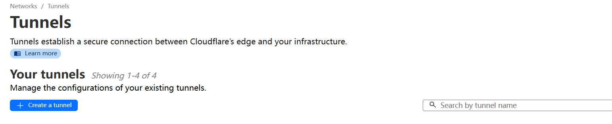
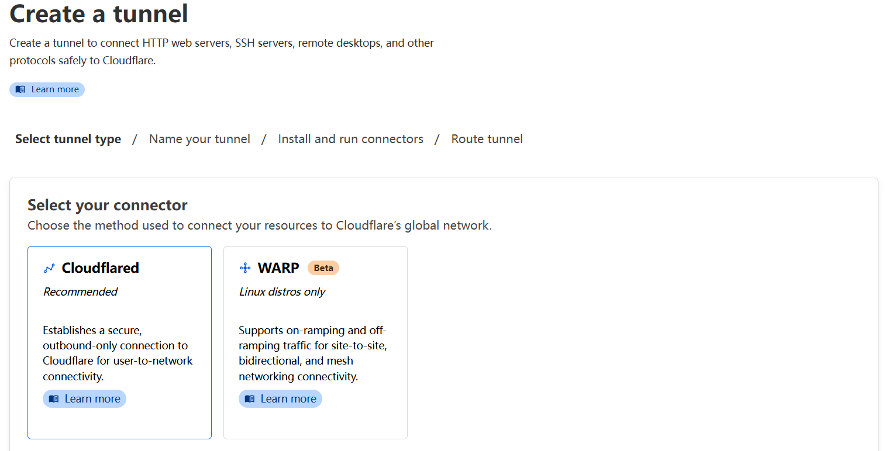
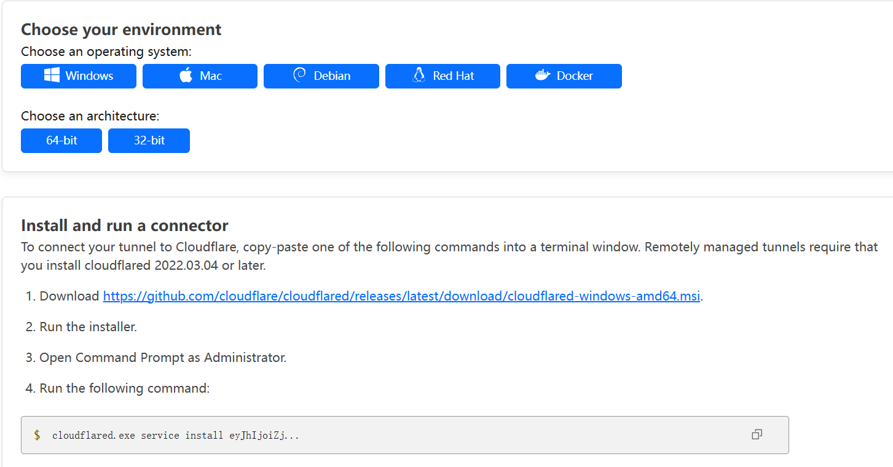

# 云函数部署

| <div style="width: 6em">部署方式</div> | 推荐度 | 描述 |
| ---- | ---- | ---- |
| [腾讯云一键部署](#腾讯云一键部署) | ★☆☆☆☆ | 虽然方便，但是仅支持按量计费环境——也就是说，**一键部署的环境，当免费资源用尽后，将会产生费用**。且按量计费环境无法切换为包年包月环境。免费额度数据库读操作数只有 500 次 / 天，**无法支撑 Twikoo 的运行需求**。 |
| [腾讯云手动部署](#腾讯云手动部署) | ★★☆☆☆ | 手动部署到腾讯云云开发环境，在中国大陆访问速度较快。需要付费购买环境才能部署。 |
| [腾讯云命令行部署](#腾讯云命令行部署) | ★☆☆☆☆ | 仅针对有 Node.js 经验的开发者。 |
| [Vercel 部署](#vercel-部署) | ★★★☆☆ | 适用于想要免费部署的用户，在中国大陆访问速度较慢甚至无法访问，绑定自己的域名可以提高访问速度。 |
| [Railway 部署](#railway-部署) | ★★☆☆☆ | 有免费额度但不足以支持一个月连续运行，部署简单，适合全球访问。 |
| [Zeabur 部署](#zeabur-部署) | ★☆☆☆☆ | 需要绑定支付宝或信用卡，部署简单，适合中国大陆访问，免费计划环境随时可能会被删除。 |
| [Netlify 部署](#netlify-部署) | ★★★★☆ | 有充足的免费额度，中国大陆访问速度不错。 |
| [Hugging Face 部署](#hugging-face-部署) | ★★★★☆ | 免费，中国大陆访问速度不错。允许通过 Cloudflare Tunnels 自定义域名。 |
| [AWS Lambda 部署](#aws-lambda-部署) | ★★★☆☆ | 全球最大的云平台，适合已经使用 AWS 全家桶的用户。 |
| [Cloudflare workers 部署](#cloudflare-workers-部署) | ★★☆☆☆ | 部署需使用命令行，冷启动时间较短，功能有部分限制。 |
| [私有部署](#私有部署) | ★★☆☆☆ | 适用于有服务器的用户，需要自行申请 HTTPS 证书。 |
| [私有部署 (Docker)](#私有部署-docker) | ★★★☆☆ | 适用于有服务器的用户，需要自行申请 HTTPS 证书。 |

## 腾讯云一键部署

1. 点击以下按钮将 Twikoo 一键部署到云开发<br>
[](https://console.cloud.tencent.com/tcb/env/index?action=CreateAndDeployCloudBaseProject&appUrl=https%3A%2F%2Fgithub.com%2Fimaegoo%2Ftwikoo&branch=main)
2. 进入[环境-登录授权](https://console.cloud.tencent.com/tcb/env/login)，启用“匿名登录”
3. 进入[环境-安全配置](https://console.cloud.tencent.com/tcb/env/safety)，将网站域名添加到“WEB安全域名”

## 腾讯云手动部署

如果您打算部署到一个现有的云开发环境，请直接从第 3 步开始。

1. 进入[云开发CloudBase](https://curl.qcloud.com/KnnJtUom)活动页面，滚动到“新用户专享”部分，选择适合的套餐，点击“立即购买”，按提示创建好环境。
::: tip 提示
* 推荐创建上海环境。如选择广州环境，需要在 `twikoo.init()` 时额外指定环境 `region: "ap-guangzhou"`
* 环境名称自由填写
* 推荐选择计费方式`包年包月`，套餐版本`基础版 1`，超出免费额度不会收费
* 如果提示选择“应用模板”，请选择“空模板”
:::
2. 进入[云开发控制台](https://console.cloud.tencent.com/tcb/)<br>
3. 进入[环境-登录授权](https://console.cloud.tencent.com/tcb/env/login)，启用“匿名登录”
4. 进入[环境-安全配置](https://console.cloud.tencent.com/tcb/env/safety)，将网站域名添加到“WEB安全域名”
5. 进入[环境-云函数](https://console.cloud.tencent.com/tcb/scf/index)，点击“新建云函数”
6. 函数名称请填写：`twikoo`，创建方式请选择：`空白函数`，运行环境请选择：`Nodejs 16.13`，函数内存请选择：`128MB`，点击“下一步”
7. 清空输入框中的示例代码，复制以下代码、粘贴到“函数代码”输入框中，点击“确定”
``` js
exports.main = require('twikoo-func').main
```
8. 创建完成后，点击“twikoo"进入云函数详情页，进入“函数代码”标签，点击“文件 - 新建文件”，输入 `package.json`，回车
9. 复制以下代码、粘贴到代码框中，点击“保存并安装依赖”
``` json
{ "dependencies": { "twikoo-func": "1.6.41" } }
```

## 腾讯云命令行部署

::: warning 注意
* 请确保您已经安装了 [Node.js](https://nodejs.org/en/download/)
* 请将命令、代码中“您的环境id”替换为您自己的环境id
* 第 7 步会弹出浏览器要求授权，需在有图形界面的系统下进行
* 请勿在 Termux 下操作。虽然可以部署成功，但是使用时会报错 `[FUNCTIONS_EXECUTE_FAIL] Error: EACCES: permission denied, open '/var/user/index.js'`
:::

如果您打算部署到一个现有的云开发环境，请直接从第 3 步开始。

1. 进入[云开发CloudBase](https://curl.qcloud.com/KnnJtUom)活动页面，滚动到“新用户专享”部分，选择适合的套餐（一般 0 元套餐即可），点击“立即购买”，按提示创建好环境。
2. 进入[云开发控制台](https://console.cloud.tencent.com/tcb/)<br>
3. 进入[环境-登录授权](https://console.cloud.tencent.com/tcb/env/login)，启用“匿名登录”
4. 进入[环境-安全配置](https://console.cloud.tencent.com/tcb/env/safety)，将网站域名添加到“WEB安全域名”
5. 克隆本仓库
``` sh
git clone https://github.com/twikoojs/twikoo.git # 或 git clone https://e.coding.net/imaegoo/twikoo/twikoo.git
cd twikoo
```
> 如果您没有安装 Git，也可以从 [Release](https://github.com/twikoojs/twikoo/releases) 页面下载最新的 Source code<br>
> 如果您所在的地区访问 Github 速度慢，也可以尝试另一个仓库地址：[https://imaegoo.coding.net/public/twikoo/twikoo/git](https://imaegoo.coding.net/public/twikoo/twikoo/git)
6. 安装依赖项
``` sh
npm install -g yarn # 已安装 yarn 可以跳过此步
yarn install
```
7. 授权云开发环境（此命令会弹出浏览器要求授权，需在有图形界面的系统下进行）
``` sh
yarn run login
```
8. 自动部署
``` sh
yarn deploy -e 您的环境id
```

## 宝塔面板 部署

::: warning 注意
宝塔面板 (适用 9.2.0 及以上的版本)
:::

前往 [宝塔面板官网](https://www.bt.cn/new/download.html)，选择正式版的脚本下载安装（如果已安装，请跳过此步）

1. 安装后登录宝塔面板，在左侧导航栏点击 Docker，首先进入会提示安装 Docker 服务，点击立即安装，按提示完成安装


2. 完成安装后在应用商店中找到 Twikoo ，点击安装，配置域名、端口等基本信息即可完成安装


注意：域名为非必填，如果填写了域名则通过【网站】-【反向代理】来管理，填写域名后不需要勾选【允许外部访问】，否则需要勾选后才可以通过端口访问

3. 安装后在浏览器输入上一步设置的域名或者 IP + 端口即可访问。

## Vercel 部署

::: warning 注意
Vercel 部署的环境需配合 1.4.0 以上版本的 twikoo.js 使用

默认域名 `*.vercel.app` 在中国大陆访问速度较慢甚至无法访问，绑定自己的域名可以提高访问速度
:::

[查看视频教程](https://www.bilibili.com/video/BV1Fh411e7ZH)

1. 申请 [MongoDB Atlas](./mongodb-atlas.md) 账号，获取 MongoDB 连接字符串
2. 申请 [Vercel](https://vercel.com/signup) 账号
3. 点击以下按钮将 Twikoo 一键部署到 Vercel<br>

[](https://vercel.com/import/project?template=https://github.com/twikoojs/twikoo/tree/main/src/server/vercel-min)

4. 进入 Settings - Environment Variables，添加环境变量 `MONGODB_URI`，值为前面记录的数据库连接字符串
5. 进入 Settings - Deployment Protection，设置 Vercel Authentication 为 Disabled，并 Save


6. 进入 Deployments , 然后在任意一项后面点击更多（三个点） , 然后点击 Redeploy , 最后点击下面的 Redeploy
7. 进入 Overview，点击 Domains 下方的链接，如果环境配置正确，可以看到 “Twikoo 云函数运行正常” 的提示
8. Vercel Domains（包含 `https://` 前缀，例如 `https://xxx.vercel.app`）即为您的环境 id

## Railway 部署

::: warning 注意
Railway 部署的环境需配合 1.4.0 以上版本的 twikoo.js 使用

请一定要创建 MongoDB，不创建 MongoDB 也能正常使用，但重新部署后数据会丢失！
:::

1. 在 [Railway](https://railway.app/dashboard) 申请并登录账号，点击 New Project - Provision MongoDB，名称随意
2. 打开 [twikoojs/twikoo-zeabur](https://github.com/twikoojs/twikoo-zeabur) 点击 fork 将仓库 fork 到自己的账号下
3. 回到 Railway 点击 New - GitHub Repo - Configure GitHub App - 授权 GitHub - 选择刚才 fork 的仓库，等待部署完成
4. 点开环境卡片 - Variables - New Variable，左边输入 `PORT` 右边输入 `8080` 然后点 Add
5. 同样地，添加 MongoDB 相关环境变量 - New Variable - Add Reference - MONGO* - Add，重复步骤以添加 `MONGOHOST`、`MONGOPASSWORD`、`MONGOPORT`、`MONGOUSER` 和 `MONGO_URL` 环境变量。
6. 点开环境卡片 - Settings - Environment - Domains，绑定一个域名（例如 `mytwikoo.up.railway.app`）
7. 到博客配置文件中配置 envId 为 `https://` 加域名（例如 `https://mytwikoo.up.railway.app`）

## Zeabur 部署

::: warning 注意
Zeabur 部署的环境需配合 1.4.0 以上版本的 twikoo.js 使用

请一定要创建 MongoDB，不创建 MongoDB 也能正常使用，但重新部署后数据会丢失！
:::

1. 在 [Zeabur](https://dash.zeabur.com) 申请并登录账号，点击部署新服务 - 部署其他服务 - 部署 MongoDB，名称随意
2. 打开 [twikoojs/twikoo-zeabur](https://github.com/twikoojs/twikoo-zeabur) 点击 fork 将仓库 fork 到自己的账号下
3. 回到 Zeabur 点击部署新服务 - 部署你的源代码 - 授权 GitHub - 选择刚才 fork 的仓库，名称随意
  > _无需配置数据库连接字符串！ Zeabur 已自动配置_
4. 部署好后点开环境卡片 - 设置 - 域名，绑定一个域名（例如 `mytwikoo.zeabur.app`）
5. 到博客配置文件中配置 envId 为 `https://` 加域名（例如 `https://mytwikoo.zeabur.app`）

## Netlify 部署

::: warning 注意
Netlify 部署的环境需配合 1.4.0 以上版本的 twikoo.js 使用

Netlify 免费等级（Functions Level 0）支持每月 125,000 请求次数和 100 小时函数计算时长
:::

1. 申请 [MongoDB Atlas](./mongodb-atlas.md) 账号，获取 MongoDB 连接字符串
2. 申请并登录 [Netlify](https://app.netlify.com) 账号，创建一个 Team
3. 打开 [twikoojs/twikoo-netlify](https://github.com/twikoojs/twikoo-netlify) 点击 fork 将仓库 fork 到自己的账号下
4. 回到 Netlify，点击 Add new site - Import an existing project


5. 点击 Deploy with GitHub，如果未授权 GitHub 账号，先授权，然后选择前面 fork 的 twikoo-netlify 项目


6. 点击 Add environment variables - New variable，Key 输入 `MONGODB_URI`，Value 输入前面记录的数据库连接字符串，点击 Deploy twikoo-netlify


7. 部署完成后，点击 Domain settings - 右侧 Options - Edit site name，可以设置属于自己的三级域名（`https://xxx.netlify.app`）


8. 进入 Site overview，点击上方的链接，如果环境配置正确，可以看到 “Twikoo 云函数运行正常” 的提示


9. 云函数地址（包含 `https://` 前缀和 `/.netlify/functions/twikoo` 后缀，例如 `https://xxx.netlify.app/.netlify/functions/twikoo`）即为您的环境 id

## Hugging Face 部署

::: warning 注意
Hugging Face 部署的环境，由于默认的邮件端口被屏蔽，无法使用邮件功能。详见 [twikoo/issues/638](https://github.com/twikoojs/twikoo/issues/638)
:::

1. 申请 [MongoDB Atlas](./mongodb-atlas.md) 账号，获取 MongoDB 连接字符串
2. 申请 [Hugging Face](https://huggingface.co/join) 账号
3. 登录，点击 Spaces - Create new Space


4. 输入 Space name，Select the Space SDK 选择 Docker，Choose a Docker template 选择 Blank，Space hardware 选择 FREE，选择 Public，点击 Create Space


5. 进入刚刚创建的 Space，点击页面上方的 Settings，滚动到 Variables and secrets 部分，点击 New secret，Name 输入 `MONGODB_URI`，Value 输入前面记录的数据库连接字符串，点击 Save


6. 点击页面上方的 Files - Add file - Create a new file


7. 在 Name your file 中输入 `Dockerfile`，在 Edit 区域输入以下内容

```Dockerfile
FROM imaegoo/twikoo
ENV TWIKOO_PORT 7860
EXPOSE 7860
```


8. 点击 Commit new file to main
9. 点击右上角 Settings 右方的菜单（三个点）图标 - Embed this Space，Direct URL 下的内容（例如 `https://xxx-xxx.hf.space`）即为您的环境 id


### 如果你需要自定义域名

> 自定义域名教程由 [Hoshino-Yumetsuki](https://github.com/Hoshino-Yumetsuki) 提供
>
> ps：除了 `CF_ZERO_TRUST_TOKEN` 这个环境变量以外，其他环境变量的配置方式与上一步相同

1. 申请 Cloudflare Zero Trust，关于申请方式请自行查找



2. 添加一条隧道，连接方式选择 Cloudflared，名称任意



3. 添加一个 Public Hostname，回源选择 HTTP，端口选择 8080
4. Clone Twikoo 仓库，找到 `src\server\hf-space`
5. 去 Hugging Face 创建一个 Space，然后 Clone 下来，将 hf-space 文件夹内的所有内容复制进去
6. 在 Hugging Face Space 的设置中添加一个环境变量，变量名 `CF_ZERO_TRUST_TOKEN`，值是 Tunnels 给的令牌（删掉 `cloudflared.exe service install`，只保留令牌部分）



7. Push 到 Hugging Face Space 仓库

## AWS Lambda 部署

1. 注册 AWS 账号并配置 Terraform CLI。
2. 如需使用托管的 MongoDB 数据库，可申请 [MongoDB Atlas](./mongodb-atlas.md) 账号。
3. 参考 `src/server/aws-lambda/terraform` 目录中 Terraform 代码创建 AWS 资源。
4. 部署完成后，Terraform 会将 `lambda_function_url` 打印在屏幕上，您也可以使用 `terraform output` 获取这一 URL，如：

```
$ terraform output
lambda_function_url = "https://axtoiiithbcexamplegq7ozalu0cnkii.lambda-url.us-west-2.on.aws/"
```

该 URL 即为您的环境 ID，请记下这一 URL 用于前端配置。

## Cloudflare workers 部署

请参考 [github.com/twikoojs/twikoo-cloudflare](https://github.com/twikoojs/twikoo-cloudflare)

## 私有部署

::: warning 注意
私有部署的环境需配合 1.6.0 或以上版本的 twikoo.js 使用

私有部署对服务器系统没有要求，Windows、Ubuntu、CentOS、macOS 等常用系统均支持。

私有部署涉及终端操作、申请证书、配置反向代理或负载均衡等高级操作，如果对这些不太了解，建议优先选择其他方式部署。
:::

1. 服务端下载安装 [Node.js](https://nodejs.org/zh-cn/)
2. 安装 Twikoo server: `npm i -g tkserver`
3. 根据需要配置环境变量，所有的环境变量都是可选的

| 名称 | 描述 | 默认值 |
| ---- | ---- | ---- |
| `MONGODB_URI` | MongoDB 数据库连接字符串，不传则使用 lokijs | `null` |
| `MONGO_URL` | MongoDB 数据库连接字符串，不传则使用 lokijs | `null` |
| `TWIKOO_DATA` | lokijs 数据库存储路径 | `./data` |
| `TWIKOO_PORT` | 端口号 | `8080` |
| `TWIKOO_THROTTLE` | IP 请求限流，当同一 IP 短时间内请求次数超过阈值将对该 IP 返回错误 | `250` |
| `TWIKOO_LOCALHOST_ONLY` | 为`true`时只监听本地请求，使得 nginx 等服务器反代之后不暴露原始端口 | `null` |
| `TWIKOO_LOG_LEVEL` | 日志级别，支持 `verbose` / `info` / `warn` / `error` | `info` |
| `TWIKOO_IP_HEADERS` | 在一些特殊情况下使用，如使用了 `CloudFlare CDN` 它会将请求 IP 写到请求头的 `cf-connecting-ip` 字段上，为了能够正确的获取请求 IP 你可以写成 `["headers.cf-connecting-ip"]` | `[]` |

4. 启动 Twikoo server: `tkserver`
5. 访问 `http://服务端IP:8080` 测试服务是否启动成功
6. 配置前置代理实现 HTTPS 访问（可以用 Nginx、负载均衡或 Cloudflare 等）
7. 到博客配置文件中配置 envId 为 `https://` 加域名（例如 `https://twikoo.yourdomain.com`）

::: tip 提示
1. Linux 服务器可以用 `nohup tkserver >> tkserver.log 2>&1 &` 命令后台启动
2. 数据默认在 data 目录，请注意定期备份数据
3. 默认端口为8080，自定义端口使用可使用 `TWIKOO_PORT=1234 tkserver` 启动。
4. 配置systemctl服务配合`TWIKOO_PORT=1234 tkserver`设置开机启动
:::

## 私有部署 (Docker)

::: warning 注意
私有部署的环境需配合 1.6.0 或以上版本的 twikoo.js 使用

私有部署涉及终端操作、申请证书、配置反向代理或负载均衡等高级操作，如果对这些不太了解，建议优先选择其他方式部署。
:::

### Docker

```sh
docker run --name twikoo -e TWIKOO_THROTTLE=1000 -p 8080:8080 -v ${PWD}/data:/app/data -d imaegoo/twikoo
```

### Docker Compose

```yml
version: '3'
services:
  twikoo:
    image: imaegoo/twikoo
    container_name: twikoo
    restart: unless-stopped
    ports:
      - 8080:8080
    environment:
      TWIKOO_THROTTLE: 1000
    volumes:
      - ./data:/app/data
```
