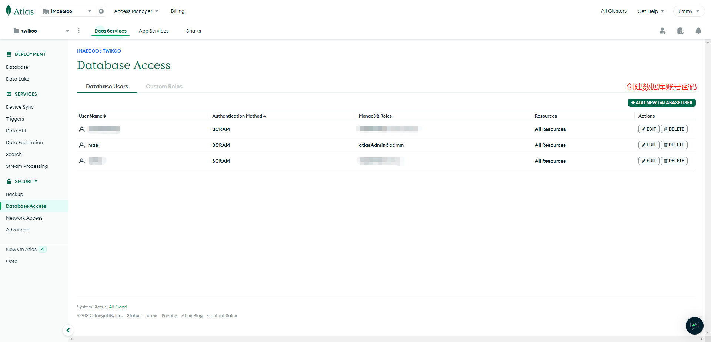
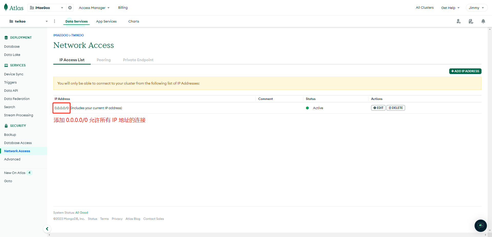
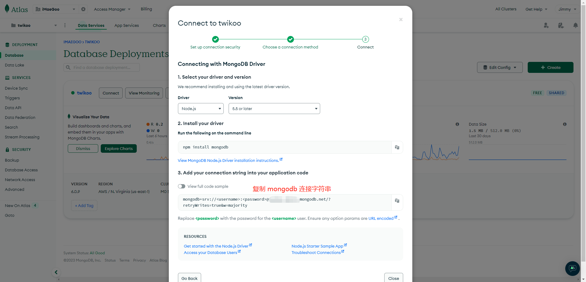

# MongoDB Atlas

MongoDB Atlas is the managed MongoDB service provided by MongoDB Inc. A free account gets 500 MiB of storage permanently, which is more than enough for Twikoo comments.

1. Register a [MongoDB Atlas](https://www.mongodb.com/cloud/atlas/register) account.
2. Create a free MongoDB cluster. Pick a region close to your Twikoo backend (Vercel / Netlify / AWS Lambda / VPS) for lower database latency. If you are not sure where your backend runs, `AWS / Oregon (us-west-2)` is a reasonable default: mature infrastructure, low failure rate and clean energy.
3. On the **Database Access** page, click **Add New Database User**, choose **Password** as the authentication method, then set a username and password. Clicking **Auto Generate** gives you a strong password without special characters — save it somewhere safe. Under **Database User Privileges**, click **Add Built In Role**, select **Atlas Admin**, then click **Add User**.

4. On the **Network Access** page, click **Add IP Address** to add a network whitelist entry. Because the egress addresses of Vercel / Netlify / Lambda are not fixed, enter `0.0.0.0/0` (allow connections from any IP). If Twikoo is deployed on your own server, you can enter a fixed IP instead. Click **Confirm** to save.

5. On the **Database** page, click **Connect**, choose **Drivers**, and note the connection string. Replace `<username>:<password>` in the string with the database user you just created.

6. (Optional) The default connection string does not specify a database name, so Twikoo connects to the default database named `test`. If you need to run other services in the same MongoDB instance, or share it between several Twikoo instances, append the database name and configure the corresponding ACL.

::: warning
The connection string contains everything needed to access your MongoDB database. If it leaks, anyone can add, modify or delete comments, and may also obtain your SMTP credentials, image-hosting tokens and other secrets. Keep this string safe — you will need to paste it into your Twikoo deployment platform.
:::
