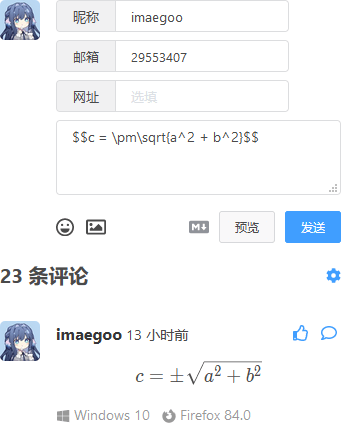
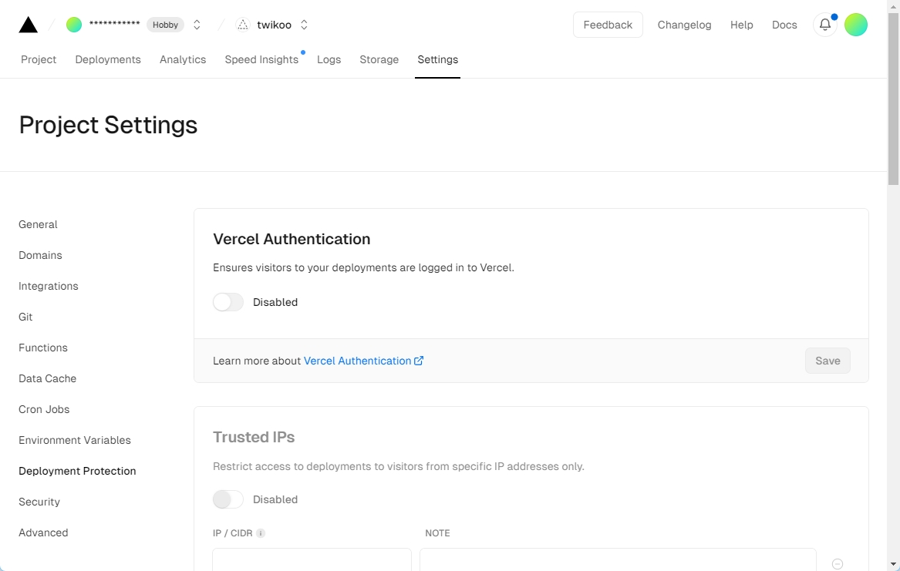

# 常见问题

## 如何修改头像？

请前往 [https://weavatar.com](https://weavatar.com) 通过邮箱注册并设定头像，评论时，请留下相同的邮箱。

访客还可以通过输入数字 QQ 邮箱地址，使用 QQ 头像发表评论。

## 如何修改、重置管理员密码？

腾讯云请前往[云开发控制台](https://console.cloud.tencent.com/tcb/database/collection/config)，Vercel 请前往 MongoDB，私有部署请直接编辑 `data/db.json.1`，编辑配置，删除 config.ADMIN_PASS 配置项，然后前往 Twikoo 管理面板重新设置密码。

## 如何获得管理面板的私钥文件？

1. 进入[环境-登录授权](https://console.cloud.tencent.com/tcb/env/login)，点击“自定义登录”右边的“私钥下载”，下载私钥文件
2. 用文本编辑器打开私钥文件，复制全部内容
3. 点击评论窗口的“小齿轮”图标，粘贴私钥文件内容，并设置管理员密码

## 忘记暗号，无法进入管理面板怎么办？

在包含评论框的页面，打开浏览器开发者工具（Windows 下快捷键为 F12），点击 Network 标签，刷新一下页面，点击放大镜图标（Search），在出现的搜索栏中输入 `HIDE_ADMIN_CRYPT`，点击搜索栏旁边的刷新图标（Refresh），即可找到您的暗号。


请注意，暗号并非管理面板的加密手段，仅用于向普通访客隐藏管理面板，请勿把暗号和管理面板的密码设置为相同的字符串。

## 如何开启文章访问量统计？

您可以在需要展示文章访问量的地方添加：

``` html
<span id="twikoo_visitors">0</span>
```

来展示访问量。暂不支持全站访问量统计。

## 如何启用 Katex 支持？

Twikoo 支持 Katex 公式，但为了限制 Twikoo 的包大小，Twikoo 没有内置完整的 Katex，您需要[在页面中额外加载 katex.js](https://katex.org/docs/browser.html)。

``` html
<head>
  <link rel="stylesheet" href="https://cdn.jsdelivr.net/npm/katex@0.12.0/dist/katex.min.css" integrity="sha384-AfEj0r4/OFrOo5t7NnNe46zW/tFgW6x/bCJG8FqQCEo3+Aro6EYUG4+cU+KJWu/X" crossorigin="anonymous">
  <script defer src="https://cdn.jsdelivr.net/npm/katex@0.12.0/dist/katex.min.js" integrity="sha384-g7c+Jr9ZivxKLnZTDUhnkOnsh30B4H0rpLUpJ4jAIKs4fnJI+sEnkvrMWph2EDg4" crossorigin="anonymous"></script>
  <script defer src="https://cdn.jsdelivr.net/npm/katex@0.12.0/dist/contrib/auto-render.min.js" integrity="sha384-mll67QQFJfxn0IYznZYonOWZ644AWYC+Pt2cHqMaRhXVrursRwvLnLaebdGIlYNa" crossorigin="anonymous"></script>
</head>
```

载入后，您可以发送 `$$c = \pm\sqrt{a^2 + b^2}$$` 测试效果。



您还可以在 `twikoo.init` 时传入自定义 katex 配置，详细配置请查看 [Katex Auto-render Extension](https://katex.org/docs/autorender.html)。

``` js
twikoo.init({
  envId: '您的环境id',
  el: '#tcomment',
  katex: {
    delimiters: [
      { left: '$$', right: '$$', display: true },
      { left: '$', right: '$', display: false },
      { left: '\\(', right: '\\)', display: false },
      { left: '\\[', right: '\\]', display: true }
    ],
    throwOnError: false
  }
});
```

## 如何配置反垃圾？

### 使用腾讯云内容安全服务

Twikoo 支持接入腾讯云文本内容检测，使用深度学习技术，识别涉黄、涉政、涉恐等有害内容，同时支持用户配置词库，打击自定义的违规文本。

腾讯云文本内容检测是付费服务，提供 1 个月的免费试用，之后价格为 25 元/万条。如果您对反垃圾评论要求不高，也可以使用免费的 Akismet。

如何申请腾讯云文本内容检测

1. 访问[腾讯云控制台-文本内容安全](https://console.cloud.tencent.com/cms/text/overview)，开通文本内容安全服务
2. 访问[腾讯云控制台-用户列表](https://console.cloud.tencent.com/cam)，点击新建用户，点击快速创建
3. 输入用户名，访问方式选择“编程访问”，用户权限取消“AdministratorAccess”，只勾选“QcloudTMSFullAccess”
4. 点击“创建用户”
5. 复制“成功新建用户”页面的“SecretId”和“SecretKey”，到 Twikoo 管理面板“反垃圾”模块中配置
6. 测试反垃圾效果

成功后，站长可以在[腾讯云控制台-自定义库管理](https://console.cloud.tencent.com/cms/text/lib)配置自定义文本内容过滤。

### 使用 Akismet 反垃圾服务

Akismet (Automattic Kismet) 是应用广泛的一个垃圾留言过滤系统，其作者是大名鼎鼎的 WordPress 创始人 Matt Mullenweg，Akismet 也是 WordPress 默认安装的插件，其使用非常广泛，设计目标便是帮助博客网站来过滤垃圾留言。

1. 注册 [akismet.com](https://akismet.com)
2. 选择 Akismet Personal 订阅，复制得到的 Akismet API Key，到 Twikoo 管理面板“反垃圾”模块中配置

### 如何测试 Akismet 反垃圾配置是否生效？

请填写 `viagra-test-123` 作为昵称，或填写 `akismet-guaranteed-spam@example.com` 作为邮箱，发表评论，这条评论将一定会被视为垃圾评论。

需要注意的是，由于 Akismet 服务响应速度较慢（大约 6 秒），影响用户体验，Twikoo 采取 “先放行，后检测” 的策略，垃圾评论会在发表后短暂可见。

## 登录管理面板遇到错误 AUTH_INVALID_CUSTOM_LOGIN_TICKET

一般是配置好登录私钥之后，又重新下载了登录私钥，导致之前配置的登录私钥失效了。<br>
解决方法：到[云开发控制台](https://console.cloud.tencent.com/tcb/database/collection/config)，数据库，删掉 config，然后重新配置私钥。

## 收不到提醒邮件？

如果是 Vercel 部署的云函数，请配置国外邮件服务商，避免被邮件服务商判定为垃圾邮件行为。如果是其他原因，请前往 Twikoo 管理面板，找到邮件测试功能，输入个人邮箱，根据测试结果排查原因。

如果是 Vercel 部署的云函数，邮件测试正常，但实际评论收不到任何即时消息通知 / 邮件通知，请打开 Vercel 云函数管理页面，进入 Settings - Deployment Protection，设置 Vercel Authentication 为 Disabled，并 Save。



为了避免频繁检查邮箱带来的性能问题，邮件配置有 10 分钟左右的缓存，如果确定配置没有问题，但测试失败，可以等待 10 分钟后再测试。

由于博主发表评论时，不会通知博主，如果您想实际测试通知功能，请注销管理面板后用非博主邮箱发表或回复评论。

## Vercel、私有部署无法上传图片？

腾讯云环境自带云存储，所以腾讯云环境下可以直接上传图片，图片保存在云存储中。然而 Vercel 环境没有，上传图片功能依赖第三方图床，请在管理面板中配置图床，Twikoo 支持以下图床：

| 图床 | 地址 | 特点 |
| ---- | ---- | ---- |
| qcloud | 无 | 腾讯云环境自带，可在云开发 - 云存储中查看 |
| 7bu | https://7bu.top | 去不图床，由杜老师提供支持，无免费套餐 |
| smms | https://sm.ms | SMMS 图床，有免费套餐，请自行注册账号，`IMAGE_CDN_TOKEN` 可在 [Dashboard](https://sm.ms/home/apitoken) 中获取 |
| [lsky-pro](https://www.lsky.pro) | 私有部署 | 兰空图床 2.0 版本，`IMAGE_CDN` 请配置图床首页 URL 地址（如 `https://7bu.top`），`IMAGE_CDN_TOKEN` 获取方式请参考教程 [杜老师说图床：新版本去不图床 Token 的获取与清空](https://dusays.com/454/)，获取到的 token 格式应为 `1\|1bJbwlqBfnggmOMEZqXT5XusaIwqiZjCDs7r1Ob5`） |
| [PicList](https://piclist.cn/)                         | 私有部署        | `IMAGE_CDN_URL` 配置图床 URL 地址，`IMAGE_CDN_TOKEN`填写参考[piclist文档：接口鉴权](https://piclist.cn/advanced.html#%E6%8E%A5%E5%8F%A3%E9%89%B4%E6%9D%83) |
| [EasyImage2.0](https://github.com/icret/EasyImages2.0) | 私有部署        | `IMAGE_CDN_URL` 配置图床 URL 地址，`IMAGE_CDN_TOKEN`填写 TOKEN |

## 私有部署能连接自己的数据库吗？

Twikoo 私有部署版默认使用内置数据库：LokiJS 数据库，支持的数据库容量大约为 1 GB，不需要连接外部数据库，数据存储在启动 twikoo 时所在目录下的 data 目录，您可以直接复制该目录以完成数据备份。

如果您有 MongoDB 实例，可以连接 MongoDB 作为外部数据库，只需配置环境变量 MONGODB_URI 为数据库连接地址即可，如：`mongodb://<username>:<password>@<host>/`。

## 部署后遇到评论失败: 0，管理面板进不去？

在包含评论框的页面，打开浏览器开发者工具（Windows 下快捷键为 F12），点击 Console 标签，查找包含 twikoo 关键字的报错。

如果看到 ERR_BLOCKED_BY_CLIENT，请禁用浏览器去广告插件或将当前网站加入白名单，然后刷新重试。

如果看到 ERR_CONNECTION_CLOSED / ERR_CONNECTION_TIMED_OUT / ERR_CONNECTION_RESET，请检查自己所处的地区网络环境是否正常，能够连通云函数，部分地区无法访问 Vercel 等服务，请更换部署方式再试。

如果看到 `Access to XMLHttpRequest at 'https://tcb-api.tencentcloudapi.com/web?env=...' from origin '...' has been blocked by CORS policy...`：请检查前端 js 文件版本是否最新，并确保 envId 以 `https://` 开头。

如果看到 `Access to XMLHttpRequest at ... No 'Access-Control-Allow-Origin' header is present on the requested resource.`：请先访问一下 envId 查看云函数是否运行正常，如果没有运行正常的提示，请重新部署云函数，确保不要漏下任何步骤；如果提示运行正常，请本地启动网站（localhost）并访问管理面板-配置管理-通用，清空 `CORS_ALLOW_ORIGIN` 字段并保存，然后刷新重试。

如果看到其他错误，请 [提交 issue](https://github.com/twikoojs/twikoo/issues/new) 并附上错误信息。
